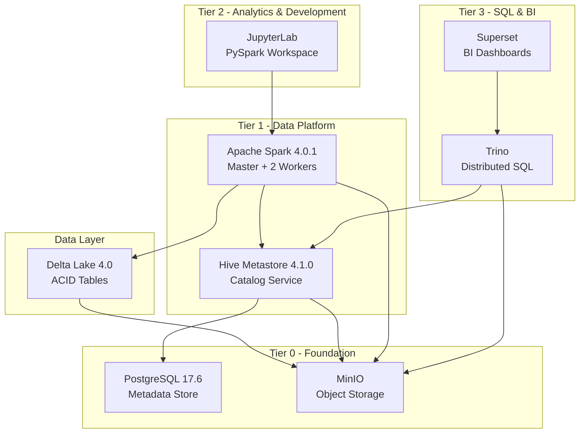

# FlumenData

<p align="center">
  
</p>

<p align="center"><strong>Composable Lakehouse platform • Spark 4 + Delta Lake 4 • Docker Compose • Ready in minutes</strong></p>

<p align="center">
  <a href="#-quick-start">Quick start</a> ·
  <a href="#-architecture">Architecture</a> ·
  <a href="#-brand-system">Brand system</a> ·
  <a href="./README_PT.md">Português</a>
</p>

<p align="center">
  
  
  
</p>

## 🎯 Overview

FlumenData is an **open-source lakehouse platform** that combines the best of data lakes and data warehouses. Built with Docker Compose, it provides a complete, reproducible environment for modern data engineering and analytics.

**Current Status:**
- ✅ **Tier 0 (Foundation)**: PostgreSQL, MinIO - validated and stable
- ✅ **Tier 1 (Data Platform)**: Apache Spark 4.0.1, Hive Metastore 4.1.0, Delta Lake 4.0 - operational
- ✅ **Tier 2 (Analytics & Development)**: JupyterLab - ready for daily use
- ✅ **Tier 3 (SQL & BI)**: Trino, Superset - tuned for portfolio demos

## ✨ Key Features

- **ACID Transactions**: Delta Lake provides ACID guarantees on object storage
- **Time Travel**: Query historical versions of your data
- **Schema Evolution**: Adapt schemas without breaking existing pipelines
- **S3-Compatible Storage**: MinIO for scalable object storage
- **Hive Metastore**: Industry-standard catalog with 2-level namespace
- **Distributed Compute**: Apache Spark cluster (1 Master + 2 Workers)
- **One Command Setup**: `make init` starts the entire platform

## 🏗️ Architecture



### Technology Stack

| Layer | Technology | Version | Purpose |
|-------|-----------|---------|---------|
| **Storage** | MinIO | RELEASE.2025-09-07 | S3-compatible object storage |
| **Storage** | Delta Lake | 4.0.0 | ACID table format with time travel |
| **Metadata** | Hive Metastore | 4.1.0 | Centralized catalog |
| **Metadata** | PostgreSQL | 17.6 | Metadata backend |
| **Compute** | Apache Spark | 4.0.1 | Distributed query engine |
| **Analytics** | JupyterLab | spark-4.0.1 | PySpark notebooks & exploration |
| **SQL** | Trino | 450 | Distributed SQL engine |
| **BI** | Superset | 5.0.0 | Dashboards and data exploration |

## 🚀 Quick Start

### Prerequisites

- Docker 20.10+
- Docker Compose 2.0+
- GNU Make
- 16 GB RAM minimum (32 GB recommended)
- 20 GB free disk space

### Installation

```bash
# 1. Clone the repository
git clone https://github.com/lucianomauda/FlumenData.git
cd FlumenData

# 2. Initialize the environment
make init

# 3. Verify all services are healthy
make health

# 4. View environment summary
make summary
```

### Your First Query

```bash
# Open Spark SQL shell
make shell-spark-sql

# Create a database
CREATE DATABASE quickstart
LOCATION 's3a://lakehouse/warehouse/quickstart.db';

# Create a Delta table
CREATE TABLE quickstart.customers (
  id BIGINT,
  name STRING,
  email STRING
) USING DELTA;

# Insert data
INSERT INTO quickstart.customers VALUES
  (1, 'Alice', 'alice@example.com'),
  (2, 'Bob', 'bob@example.com');

# Query data
SELECT * FROM quickstart.customers;
```

## 📊 Web Interfaces

After running `make init`, access:

- **Spark Master UI**: http://localhost:8080 - Cluster status and job monitoring
- **MinIO Console**: http://localhost:9001 - Object storage management
  - Username: `minioadmin`
  - Password: `minioadmin123`
  - Buckets: `lakehouse` (Delta tables), `storage` (ingest-ready files)
- **JupyterLab**: http://localhost:8888 - Data exploration notebooks (`make token-jupyterlab` to fetch the access token)
- **Trino Console**: http://localhost:${TRINO_PORT} - Query history and thread pools
- **Superset**: http://localhost:${SUPERSET_PORT} - BI dashboards (login: `admin` / `admin123`)

## 📖 Documentation

Comprehensive documentation is available in both English and Portuguese:

- **English**: [docs/index.md](docs/index.md)
- **Portuguese**: [docs/index.pt.md](docs/index.pt.md)

Key documentation pages:
- [Installation Guide](docs/getting-started/installation.md)
- [Quick Start Tutorial](docs/getting-started/quickstart.md)
- [Architecture Deep Dive](docs/getting-started/architecture.md)
- [Hive Metastore](docs/services/hive.md)
- [Apache Spark](docs/services/spark.md)
- [Apache Superset](docs/services/superset.md)
- [Configuration](docs/configuration/environment.md)
- [Make Commands Reference](docs/configuration/commands.md)

## 🛠️ Common Commands

```bash
# Service Management
make init              # Complete initialization
make up                # Start all services
make up-tier2          # Start analytics & ML services
make up-tier3          # Start orchestration & BI services
make build-superset    # Build Superset image with drivers
make down              # Stop all services
make restart           # Restart all services

# Health Checks
make health            # Check all services
make health-tier0      # Check foundation services
make health-tier1      # Check data platform services
make health-tier2      # Check analytics & ML services
make health-tier3      # Check orchestration & BI services

# Testing
make test              # Run all tests
make test-tier0        # Test Tier 0 services
make test-tier1        # Test Tier 1 services
make test-tier2        # Test Tier 2 services
make test-tier3        # Test Tier 3 services

# Interactive Shells
make shell-spark       # Spark Scala shell
make shell-pyspark     # PySpark Python shell
make shell-spark-sql   # Spark SQL shell
make shell-postgres    # PostgreSQL shell
make sql-trino         # Trino CLI shell
make mc                # MinIO client

# Maintenance
make logs              # View all logs
make summary           # Environment overview
make reset             # Reset and reinitialize
make clean             # Remove everything (DESTRUCTIVE)
```

## 🎨 Brand System

| Token | Hex | Usage |
|-------|-----|-------|
| **FD Dark** | `#14171C` | Hero backgrounds, dark shells, CLI snippets |
| **FD Cyan (Trino)** | `#20EFFD` | Trino callouts, fast-query highlights, accent borders |
| **FD Orange (JupyterLab)** | `#FDA931` | JupyterLab/experimentation badges |
| **FD Blue / Teal (Superset)** | `#0082C8` | Superset UI mentions, BI tiles |
| **FD Lime** | `#B8E762` | Health checks, success states |
| **FD Teal Deep** | `#157983` | Foundation services (PostgreSQL/MinIO) and navigation highlights |
| **FD Light** | `#F5F7FB` | Neutral backgrounds, cards |
| **FD Gray / FD Gray Dark** | `#9CA3AF` / `#4B5563` | Secondary text, borders, inactive elements |

- When mapping services, keep the tool-specific rules: **JupyterLab → orange**, **Trino → cyan**, **Superset → blue/teal**, **foundation** nodes → teal with lime accents.
- For status chips, use lime for healthy/running and gray for neutral/offline.
- In diagrams, stay within two or three bright colors at a time so the layout remains clean.

## ✏️ Typography & Assets

| Context | Font stack | Notes |
|---------|------------|-------|
| Headings / logotype | Space Grotesk (700 for H1, 600 for H2/H3) | Primary identity typeface used across README and MkDocs hero sections |
| Body content | Inter (400/500) | Applied everywhere through `docs/assets/styles/brand.css` |
| Code & configuration | JetBrains Mono (fallback: Fira Code) | Shell commands, SQL, YAML, docker-compose snippets |

- The docs site loads these fonts via `docs/assets/styles/brand.css`, which also sets the Material theme palette to the brand colors.
- Use the vector logos located under `docs/assets/images/` (`flumendata-logowithname.png`, `flumendata-logoonly.png`, `flumendata.ico`) for README hero blocks, MkDocs logos, and future diagrams.
- For GitHub-specific assets (badges, callouts), stick to the palette above to keep the identity cohesive.

## 📁 Project Structure

```
FlumenData/
├── config/                     # Generated configuration (DO NOT EDIT)
├── docker/                     # Custom Dockerfiles
│   ├── hive.Dockerfile        # Hive Metastore + PostgreSQL JDBC
│   ├── spark.Dockerfile       # Spark with health checks
│   └── superset.Dockerfile    # Superset with psycopg2 + sqlalchemy-trino
├── docs/                       # MkDocs Material documentation (EN + PT)
├── makefiles/                  # Service-specific Makefiles
│   ├── postgres.mk
│   ├── minio.mk
│   ├── hive.mk
│   ├── spark.mk
│   ├── jupyterlab.mk
│   ├── trino.mk
│   └── superset.mk
├── templates/                  # Configuration templates
│   ├── hive/
│   ├── spark/
│   ├── minio/
│   ├── jupyterlab/
│   ├── trino/
│   └── superset/
├── .env                        # Environment variables (not in git)
├── docker-compose.tier0.yml    # Foundation services
├── docker-compose.tier1.yml    # Data platform services
├── docker-compose.tier2.yml    # Analytics & development services
├── docker-compose.tier3.yml    # Orchestration & BI services
├── Makefile                    # Main orchestration
├── mkdocs.yml                 # Documentation configuration
└── README.md                   # This file
```

## 🎓 Use Cases

FlumenData is perfect for:

- **Learning**: Understand modern data lakehouse architecture hands-on
- **Development**: Build and test data pipelines locally
- **Prototyping**: Experiment with Delta Lake and Spark
- **Training**: Teach data engineering concepts
- **POCs**: Prove concepts before production deployment

## 🔄 Roadmap

- ✅ **Tier 0 – Foundation**: PostgreSQL, MinIO
- ✅ **Tier 1 – Data Platform**: Spark, Hive Metastore, Delta Lake
- ✅ **Tier 2 – Analytics & Development**: JupyterLab
- ✅ **Tier 3 – SQL & BI**: Trino, Superset

Key guidelines:
- All code and comments in English
- Update both EN and PT documentation
- Run `make test` before submitting
- Follow existing code structure

## 📝 Conventions

- **Configuration Management**: Always edit templates in `templates/`, never edit generated files in `config/`
- **Service Requirements**: Every service must have healthcheck, named volumes, and static config
- **Documentation**: Maintained in both English and Portuguese
- **Commits**: Use conventional commits format (e.g., `feat(spark): add Delta Lake 4.0 support`)

## 🐛 Troubleshooting

### Services not starting

```bash
# Check Docker resources
docker stats

# View logs
make logs

# Verify health
make health
```

### Configuration issues

```bash
# Regenerate all configs
make config

# Restart services
make restart
```

### Data issues

```bash
# Complete reset (keeps data)
make reset

# Nuclear option (deletes everything)
make clean
```

For more troubleshooting tips, see the [documentation](docs/getting-started/installation.md#troubleshooting-installation).

## 🙏 Acknowledgments

FlumenData builds on amazing open-source projects:
- [Apache Spark](https://spark.apache.org/)
- [Delta Lake](https://delta.io/)
- [Apache Hive](https://hive.apache.org/)
- [MinIO](https://min.io/)
- [PostgreSQL](https://www.postgresql.org/)
- [Trino](https://trino.io/)
- [Apache Superset](https://superset.apache.org/)
- [Project Jupyter](https://jupyter.org/)

## 📧 Contact

- **Issues**: https://github.com/lucianomauda/FlumenData/issues
- **Discussions**: https://github.com/lucianomauda/FlumenData/discussions

---

**FlumenData** - Open, reproducible, and modern Lakehouse for everyone 🚀
