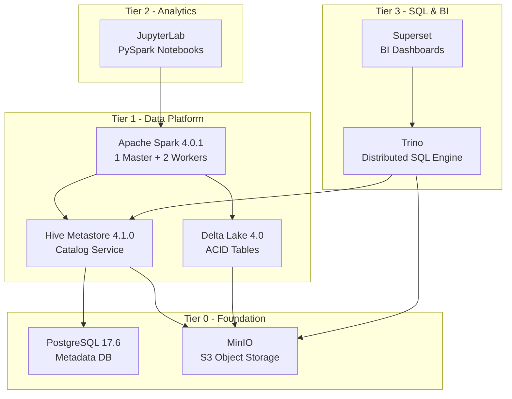

# FlumenData

<p align="center">
  
</p>

<p align="center"><strong>Production-ready Lakehouse Platform • Spark 4 + Delta Lake 4 • Docker Compose • Ready in 5 minutes</strong></p>

<p align="center">
  <a href="#-quick-start">Quick Start</a> ·
  <a href="docs/getting-started/installation.md">Installation</a> ·
  <a href="docs/">Documentation</a> ·
  <a href="./README_PT.md">Português</a>
</p>

<p align="center">
  
  
  
  
  
</p>

---

## 🎯 What is FlumenData?

**FlumenData** is an open-source lakehouse platform that combines the best of data lakes and data warehouses. Built with Docker Compose, it provides a complete, production-ready environment for modern data engineering and analytics.

**Perfect for:**
- Learning Delta Lake and Apache Spark 4
- Building data pipelines with ACID guarantees
- Portfolio projects and data science demos
- Local development before cloud deployment

**Production Status:**
- ✅ **Foundation** (PostgreSQL, MinIO) - Stable
- ✅ **Data Platform** (Spark 4, Hive, Delta Lake 4) - Production-ready
- ✅ **Analytics** (JupyterLab) - Daily use ready
- ✅ **SQL & BI** (Trino, Superset) - Demo-ready

---

## ✨ Key Features

- **🔒 ACID Transactions** - Delta Lake guarantees on object storage
- **⏰ Time Travel** - Query historical versions and rollback changes
- **🔄 Schema Evolution** - Adapt schemas without breaking pipelines
- **📦 S3-Compatible** - MinIO for scalable object storage
- **📚 Hive Metastore** - Industry-standard catalog (database.table)
- **⚡ Distributed Compute** - Spark cluster (1 Master + 2 Workers)
- **🖥️ Cross-Platform** - Works on Windows, Linux, and macOS
- **🚀 One-Command Setup** - `make init` and you're running

---

## 🏗️ Architecture



### Technology Stack

| Component | Technology | Version | Purpose |
|-----------|-----------|---------|---------|
| **Compute** | Apache Spark | 4.0.1 | Distributed processing engine |
| **Format** | Delta Lake | 4.0.0 | ACID tables with time travel |
| **Catalog** | Hive Metastore | 4.1.0 | Centralized metadata catalog |
| **Storage** | MinIO | 2025.09 | S3-compatible object storage |
| **Metadata** | PostgreSQL | 17.6 | Relational metadata backend |
| **Analytics** | JupyterLab | Latest | PySpark workspace |
| **SQL** | Trino | 450 | Distributed SQL queries |
| **BI** | Superset | 5.0.0 | Visual analytics & dashboards |

---

## 🚀 Quick Start

### Prerequisites

- **Docker** 20.10+ & **Docker Compose** 2.0+
- **Python** 3.6+
- **8GB RAM** minimum (16GB recommended)
- **20GB disk** space

> **📖 Detailed installation guide:** [docs/getting-started/installation.md](docs/getting-started/installation.md)

### Install & Run

```bash
# 1. Clone the repository
git clone https://github.com/lucianomauda/FlumenData.git
cd FlumenData

# 2. Initialize everything (builds images, starts services, runs health checks)
make init

# 3. Open JupyterLab and run the quickstart notebook
open http://localhost:8888
```

**That's it!** ✨ The entire lakehouse is now running.

---

## 📚 Access Your Services

| Service | URL | Credentials |
|---------|-----|-------------|
| **JupyterLab** | http://localhost:8888 | No password |
| **Spark Master UI** | http://localhost:8080 | - |
| **MinIO Console** | http://localhost:9001 | admin / admin123 |
| **Trino** | http://localhost:8082 | - |
| **Superset** | http://localhost:8088 | admin / admin123 |

---

## 📖 Documentation

- **[Installation Guide](docs/getting-started/installation.md)** - Detailed setup for Windows/Linux/macOS
- **[Quick Start](docs/getting-started/quickstart.md)** - Your first Delta Lake table in 5 minutes
- **[Architecture](docs/getting-started/architecture.md)** - How all components work together
- **[CLI Reference](docs/configuration/commands.md)** - Complete command documentation
- **[Service Guides](docs/services/)** - Deep dives into each component

---

## 🛠️ Common Commands

```bash
# Service Management
make up              # Start all services
make down            # Stop all services
make restart         # Restart all services
make ps              # Show service status

# Health & Monitoring
make health          # Check all services health
make logs            # View all logs
make logs-spark      # View specific service logs

# Interactive Shells
make shell-pyspark   # Open PySpark shell
make shell-postgres  # Open PostgreSQL shell
make shell-mc        # Open MinIO client shell

# Maintenance
make clean           # Stop services & remove volumes (⚠️ deletes data)
make rebuild         # Rebuild all custom images
```

> **📖 Full command reference:** [docs/configuration/commands.md](docs/configuration/commands.md)

---

## 🎨 Brand & Design

FlumenData has a consistent visual identity. See our [Brand Guidelines](docs/brand.md) for colors, typography, and logo usage.

**Quick Reference:**
- **Primary Color:** `#157983` (Teal Blue)
- **Logo Files:** Available in `docs/assets/images/`
- **Typography:** DM Sans (headings) + Inter (body)

---

## 🤝 Contributing

Contributions are welcome! Please feel free to submit a Pull Request.

**Project Focus:**
- Keep it simple and reproducible
- Maintain cross-platform compatibility
- Prioritize developer experience
- Use standard, production-ready tools

---

## 📄 License

This project is licensed under the MIT License - see the [LICENSE](LICENSE) file for details.

---

## 🙏 Acknowledgments

Built with amazing open-source technologies:
- [Apache Spark](https://spark.apache.org/)
- [Delta Lake](https://delta.io/)
- [Apache Hive](https://hive.apache.org/)
- [MinIO](https://min.io/)
- [Trino](https://trino.io/)
- [Apache Superset](https://superset.apache.org/)

---

## 💬 Community & Support

- **Issues:** [Report bugs or request features](https://github.com/lucianomauda/FlumenData/issues)
- **Discussions:** [Ask questions and share ideas](https://github.com/lucianomauda/FlumenData/discussions)
- **Author:** [Luciano Mauda Junior](https://github.com/lucianomauda) | [LinkedIn](https://www.linkedin.com/in/lucianomaudajunior)
