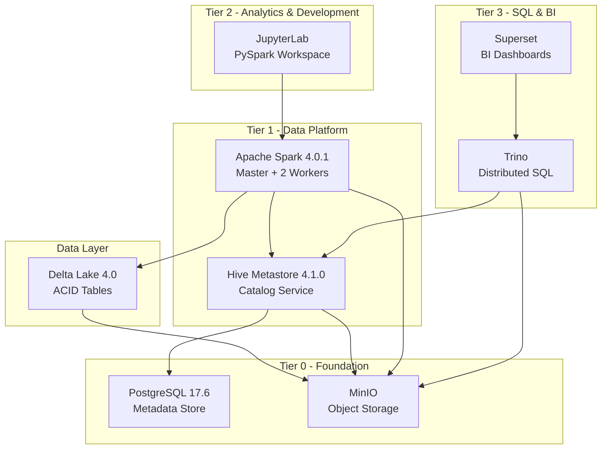

# FlumenData

<p align="center">
  
</p>

<p align="center"><strong>Composable Lakehouse platform • Spark 4 + Delta Lake 4 • Docker Compose • Ready in minutes</strong></p>

<p align="center">
  <a href="#-quick-start">Quick start</a> ·
  <a href="#-architecture">Architecture</a> ·
  <a href="#-brand-system">Brand system</a> ·
  <a href="./README_PT.md">Português</a>
</p>

<p align="center">
  
  
  
  
</p>

## 🎯 Overview

FlumenData is an **open-source lakehouse platform** that combines the best of data lakes and data warehouses. Built with Docker Compose, it provides a complete, reproducible environment for modern data engineering and analytics.

**Current Status:**
- ✅ **Tier 0 (Foundation)**: PostgreSQL, MinIO - validated and stable
- ✅ **Tier 1 (Data Platform)**: Apache Spark 4.0.1, Hive Metastore 4.1.0, Delta Lake 4.0 - operational
- ✅ **Tier 2 (Analytics & Development)**: JupyterLab - ready for daily use
- ✅ **Tier 3 (SQL & BI)**: Trino, Superset - tuned for portfolio demos

## ✨ Key Features

- **ACID Transactions**: Delta Lake provides ACID guarantees on object storage
- **Time Travel**: Query historical versions of your data
- **Schema Evolution**: Adapt schemas without breaking existing pipelines
- **S3-Compatible Storage**: MinIO for scalable object storage
- **Hive Metastore**: Industry-standard catalog with 2-level namespace
- **Distributed Compute**: Apache Spark cluster (1 Master + 2 Workers)
- **Cross-Platform CLI**: Python-based CLI works on Windows, Linux, and macOS
- **One Command Setup**: Initialize the entire platform instantly

## 🏗️ Architecture



### Technology Stack

| Layer | Technology | Version | Purpose |
|-------|-----------|---------|---------|
| **Storage** | MinIO | RELEASE.2025-09-07 | S3-compatible object storage |
| **Storage** | Delta Lake | 4.0.0 | ACID table format with time travel |
| **Metadata** | Hive Metastore | 4.1.0 | Centralized catalog |
| **Metadata** | PostgreSQL | 17.6 | Metadata backend |
| **Compute** | Apache Spark | 4.0.1 | Distributed query engine |
| **Analytics** | JupyterLab | spark-4.0.1 | PySpark notebooks & exploration |
| **SQL** | Trino | 450 | Distributed SQL engine |
| **BI** | Superset | 5.0.0 | Dashboards and data exploration |

## 🚀 Quick Start

### Prerequisites

**Required:**
- Docker 20.10+
- Docker Compose 2.0+
- Python 3.6+
- 16 GB RAM minimum (32 GB recommended)
- 20 GB free disk space

**Installing Python:**

<details>
<summary><b>Windows</b></summary>

Install Python from Microsoft Store (recommended):
1. Open **Microsoft Store**
2. Search for **"Python"**
3. Install **Python 3.12** (or latest version)
4. Verify installation:
   ```powershell
   python --version
   ```

Alternative: Download from [python.org](https://www.python.org/downloads/)

</details>

<details>
<summary><b>Linux</b></summary>

Python is usually pre-installed. Verify:
```bash
python3 --version
```

If not installed:
```bash
# Ubuntu/Debian
sudo apt update && sudo apt install python3

# Fedora/RHEL
sudo dnf install python3

# Arch
sudo pacman -S python
```

</details>

<details>
<summary><b>macOS</b></summary>

Python is pre-installed. Verify:
```bash
python3 --version
```

To install/update:
```bash
# Using Homebrew
brew install python3
```

</details>

### Installation

```bash
# 1. Clone the repository
git clone https://github.com/lucianomauda/FlumenData.git
cd FlumenData

# 2. Make CLI executable (Linux/macOS only)
chmod +x flumen

# 3. Initialize the environment
python3 flumen init

# 4. Verify all services are healthy
python3 flumen health

# 5. View environment summary
python3 flumen summary
```

**Windows users:** Use `python flumen` instead of `python3 flumen`

### Your First Query

```bash
# Open Spark SQL shell
python3 flumen shell-spark-sql

# Create a database
CREATE DATABASE quickstart
LOCATION 's3a://lakehouse/warehouse/quickstart.db';

# Create a Delta table
CREATE TABLE quickstart.customers (
  id BIGINT,
  name STRING,
  email STRING
) USING DELTA;

# Insert data
INSERT INTO quickstart.customers VALUES
  (1, 'Alice', 'alice@example.com'),
  (2, 'Bob', 'bob@example.com');

# Query data
SELECT * FROM quickstart.customers;
```

## 📊 Web Interfaces

After running `python3 flumen init`, access:

- **Spark Master UI**: http://localhost:8080 - Cluster status and job monitoring
- **MinIO Console**: http://localhost:9001 - Object storage management
  - Username: `minioadmin`
  - Password: `minioadmin123`
  - Buckets: `lakehouse` (Delta tables), `storage` (ingest-ready files)
- **JupyterLab**: http://localhost:8888 - Data exploration notebooks
  - Get token: `python3 flumen token-jupyterlab`
- **Trino Console**: http://localhost:${TRINO_PORT} - Query history and thread pools
- **Superset**: http://localhost:${SUPERSET_PORT} - BI dashboards
  - Login: `admin` / `admin123`

## 📖 Documentation

Comprehensive documentation is available in both English and Portuguese:

- **English**: [docs/index.md](docs/index.md)
- **Portuguese**: [docs/index.pt.md](docs/index.pt.md)

Key documentation pages:
- [Installation Guide](docs/getting-started/installation.md)
- [Quick Start Tutorial](docs/getting-started/quickstart.md)
- [Architecture Deep Dive](docs/getting-started/architecture.md)
- [Hive Metastore](docs/services/hive.md)
- [Apache Spark](docs/services/spark.md)
- [Apache Superset](docs/services/superset.md)
- [Configuration](docs/configuration/environment.md)

## 🛠️ Common Commands

**Get Help:**
```bash
python3 flumen           # Show welcome message
python3 flumen --help    # List all commands
```

**Service Management:**
```bash
python3 flumen init              # Complete initialization
python3 flumen up                # Start all services
python3 flumen up --tier 2       # Start analytics & ML services
python3 flumen up --tier 3       # Start orchestration & BI services
python3 flumen down              # Stop all services
python3 flumen restart           # Restart all services
python3 flumen ps                # Show container status
```

**Health Checks:**
```bash
python3 flumen health            # Check all services
python3 flumen health --tier 0   # Check foundation services
python3 flumen health --tier 1   # Check data platform services
python3 flumen health --tier 2   # Check analytics & ML services
python3 flumen health --tier 3   # Check orchestration & BI services
python3 flumen verify-hive       # Verify Hive Metastore setup
```

**Testing:**
```bash
python3 flumen test              # Run all tests
python3 flumen test --tier 0     # Test Tier 0 services
python3 flumen test --tier 1     # Test Tier 1 services
python3 flumen test --integration # Run integration test
```

**Interactive Shells:**
```bash
python3 flumen shell-spark       # Spark Scala shell
python3 flumen shell-pyspark     # PySpark Python shell
python3 flumen shell-spark-sql   # Spark SQL shell
python3 flumen shell-postgres    # PostgreSQL shell
python3 flumen shell-mc          # MinIO client
```

**Service Helpers:**
```bash
python3 flumen token-jupyterlab  # Get JupyterLab token
python3 flumen superset-db       # Initialize Superset database
```

**Maintenance:**
```bash
python3 flumen logs              # View all logs
python3 flumen summary           # Environment overview
python3 flumen config            # Regenerate all configs
python3 flumen clean             # Remove everything (DESTRUCTIVE)
python3 flumen rebuild           # Rebuild custom Docker images
python3 flumen prune             # Clean up Docker resources
```

**Optional: Using Make**

For convenience, you can also use `make` commands:
```bash
make init       # Calls: python3 flumen init
make health     # Calls: python3 flumen health
make up         # Calls: python3 flumen up
```

## 🎨 Brand System

| Token | Hex | Usage |
|-------|-----|-------|
| **FD Dark** | `#14171C` | Hero backgrounds, dark shells, CLI snippets |
| **FD Cyan (Trino)** | `#20EFFD` | Trino callouts, fast-query highlights, accent borders |
| **FD Orange (JupyterLab)** | `#FDA931` | JupyterLab/experimentation badges |
| **FD Blue / Teal (Superset)** | `#0082C8` | Superset UI mentions, BI tiles |
| **FD Lime** | `#B8E762` | Health checks, success states |
| **FD Teal Deep** | `#157983` | Foundation services (PostgreSQL/MinIO) and navigation highlights |
| **FD Light** | `#F5F7FB` | Neutral backgrounds, cards |
| **FD Gray / FD Gray Dark** | `#9CA3AF` / `#4B5563` | Secondary text, borders, inactive elements |

- When mapping services, keep the tool-specific rules: **JupyterLab → orange**, **Trino → cyan**, **Superset → blue/teal**, **foundation** nodes → teal with lime accents.
- For status chips, use lime for healthy/running and gray for neutral/offline.
- In diagrams, stay within two or three bright colors at a time so the layout remains clean.

## ✏️ Typography & Assets

| Context | Font stack | Notes |
|---------|------------|-------|
| Headings / logotype | Space Grotesk (700 for H1, 600 for H2/H3) | Primary identity typeface used across README and MkDocs hero sections |
| Body content | Inter (400/500) | Applied everywhere through `docs/assets/styles/brand.css` |
| Code & configuration | JetBrains Mono (fallback: Fira Code) | Shell commands, SQL, YAML, docker-compose snippets |

- The docs site loads these fonts via `docs/assets/styles/brand.css`, which also sets the Material theme palette to the brand colors.
- Use the vector logos located under `docs/assets/images/` (`flumendata-logowithname.png`, `flumendata-logoonly.png`, `flumendata.ico`) for README hero blocks, MkDocs logos, and future diagrams.
- For GitHub-specific assets (badges, callouts), stick to the palette above to keep the identity cohesive.

## 📁 Project Structure

```
FlumenData/
├── flumen                      # Python CLI entry point
├── Makefile                    # Optional Make wrapper
├── scripts/                    # Python CLI package
│   └── flumendata/
│       ├── __init__.py
│       ├── utils.py           # Core utilities
│       ├── config.py          # Configuration generation
│       ├── docker_ops.py      # Docker operations
│       ├── health.py          # Health checks
│       ├── init.py            # Initialization
│       ├── shell.py           # Shell access
│       ├── testing.py         # Testing commands
│       ├── cleanup.py         # Cleanup commands
│       ├── verify.py          # Verification
│       └── services.py        # Service helpers
├── config/                     # Generated configuration (DO NOT EDIT)
├── docker/                     # Custom Dockerfiles
│   ├── hive.Dockerfile        # Hive Metastore + PostgreSQL JDBC
│   ├── spark.Dockerfile       # Spark with health checks
│   └── superset.Dockerfile    # Superset with psycopg2 + sqlalchemy-trino
├── docs/                       # MkDocs Material documentation (EN + PT)
├── templates/                  # Configuration templates
│   ├── hive/
│   ├── spark/
│   ├── minio/
│   ├── jupyterlab/
│   ├── trino/
│   └── superset/
├── .env                        # Environment variables (not in git)
├── docker-compose.tier0.yml    # Foundation services
├── docker-compose.tier1.yml    # Data platform services
├── docker-compose.tier2.yml    # Analytics & development services
├── docker-compose.tier3.yml    # Orchestration & BI services
├── mkdocs.yml                 # Documentation configuration
└── README.md                   # This file
```

## 💾 Data Storage

FlumenData uses **configurable bind mounts** for user data while keeping everything else in Docker volumes.

### Data Directory Structure

Only **2 directories** are exposed as bind mounts:

```
${DATA_DIR}/                  # Default: ../flumendata-data
├── minio/                    # MinIO lakehouse storage
│   ├── lakehouse/           # Delta Lake tables
│   └── storage/             # Staging bucket for raw files
└── notebooks/               # JupyterLab notebooks (YOUR WORK)
    ├── _examples/           # Read-only examples
    ├── 01_analysis.ipynb   # Your notebooks
    └── .git/               # Optional: version control
```

Everything else (PostgreSQL metadata, Spark logs) stays in Docker volumes.

### Configuration

**Default Location:** `DATA_DIR=../flumendata-data` (sibling to FlumenData repo)

Creates this structure:
```
your-workspace/
├── FlumenData/          # This repository
└── flumendata-data/     # Your data (can be separate git repo)
```

**Change Location** - Edit `.env`:

```bash
# Relative paths (RECOMMENDED - portable)
DATA_DIR=../flumendata-data    # Sibling directory (default)
DATA_DIR=./data                # Inside project
DATA_DIR=../../my-data         # Parent directory

# Absolute paths (machine-specific)
DATA_DIR=/mnt/d/data-projects  # Windows D: drive (WSL)
DATA_DIR=~/flumendata-data     # Linux home directory
DATA_DIR=/home/user/flumen     # Linux absolute path
```

### Version Control Your Notebooks

```bash
cd /path/to/data-dir/notebooks
git init
git add .
git commit -m "Initial analysis notebooks"
git remote add origin https://github.com/yourusername/analysis.git
git push
```

**Recommended .gitignore:**
```gitignore
.ipynb_checkpoints/
_examples/
__pycache__/
*.csv
*.parquet
*.xlsx
```

### What to Backup

**Critical:**
- `${DATA_DIR}/minio/` - Your Delta Lake tables (can be TBs!)
- `${DATA_DIR}/notebooks/` - Your analysis work (use git!)

**Handled by Docker volumes:**
- PostgreSQL metadata
- Spark logs and caches
- Superset dashboards

**Backup commands:**
```bash
# Tar backup
tar -czf flumendata-backup-$(date +%Y%m%d).tar.gz /path/to/data-dir

# Or just use git for notebooks
cd /path/to/data-dir/notebooks
git push
```

## 🎓 Use Cases

FlumenData is perfect for:

- **Learning**: Understand modern data lakehouse architecture hands-on
- **Development**: Build and test data pipelines locally
- **Prototyping**: Experiment with Delta Lake and Spark
- **Training**: Teach data engineering concepts
- **POCs**: Prove concepts before production deployment

## 🔄 Roadmap

- ✅ **Tier 0 – Foundation**: PostgreSQL, MinIO
- ✅ **Tier 1 – Data Platform**: Spark, Hive Metastore, Delta Lake
- ✅ **Tier 2 – Analytics & Development**: JupyterLab
- ✅ **Tier 3 – SQL & BI**: Trino, Superset
- ✅ **Cross-Platform CLI**: Python CLI for Windows, Linux, macOS

Key guidelines:
- All code and comments in English
- Update both EN and PT documentation
- Run `python3 flumen test` before submitting
- Follow existing code structure

## 📝 Conventions

- **Configuration Management**: Always edit templates in `templates/`, never edit generated files in `config/`
- **Service Requirements**: Every service must have healthcheck, named volumes, and static config
- **Documentation**: Maintained in both English and Portuguese
- **Commits**: Use conventional commits format (e.g., `feat(spark): add Delta Lake 4.0 support`)

## 🐛 Troubleshooting

### Common Issues

#### Services not starting

```bash
# Check Docker resources
docker stats

# View logs
python3 flumen logs

# Verify health
python3 flumen health

# Check specific service
python3 flumen logs --service spark-master
```

#### Configuration issues

```bash
# Regenerate all configs
python3 flumen config

# Restart services
python3 flumen restart
```

#### Port conflicts

```bash
# Check what's using a port
sudo lsof -i :9000

# Or change port in .env
MINIO_PORT_API=9010
```

### Windows/WSL Specific

#### Docker credentials error

```bash
# Reset Docker config
cp ~/.docker/config.json ~/.docker/config.json.backup
echo '{}' > ~/.docker/config.json
```

#### Bind mount errors after restart

1. Stop all containers: `python3 flumen down`
2. Restart Docker Desktop (right-click icon → Quit → Start)
3. Or restart WSL: `wsl --shutdown` (from PowerShell)
4. Reinitialize: `python3 flumen init`

#### Slow performance on Windows drives

Use native WSL filesystem for better performance:

```bash
# In .env - use WSL native path
DATA_DIR=/home/username/flumendata-data

# Access from Windows Explorer
\\wsl$\Ubuntu\home\username\flumendata-data
```

### Complete Reset

If everything is broken:

```bash
python3 flumen down
docker system prune -af  # WARNING: Removes all Docker data
rm -rf /path/to/data-dir  # Your DATA_DIR
python3 flumen init
```

### Getting Help

If issues persist:
1. Check Docker Desktop is running
2. Verify Python version: `python3 --version`
3. Check disk space: `df -h`
4. Review logs: `python3 flumen logs`
5. Open an issue with:
   - Output of `python3 flumen --version`
   - Output of `docker version`
   - Your platform (Windows/Linux/macOS)

For more troubleshooting tips, see the [documentation](docs/getting-started/installation.md#troubleshooting-installation).

## 🙏 Acknowledgments

FlumenData builds on amazing open-source projects:
- [Apache Spark](https://spark.apache.org/)
- [Delta Lake](https://delta.io/)
- [Apache Hive](https://hive.apache.org/)
- [MinIO](https://min.io/)
- [PostgreSQL](https://www.postgresql.org/)
- [Trino](https://trino.io/)
- [Apache Superset](https://superset.apache.org/)
- [Project Jupyter](https://jupyter.org/)

## 📧 Contact

- **Issues**: https://github.com/lucianomauda/FlumenData/issues
- **Discussions**: https://github.com/lucianomauda/FlumenData/discussions

---

**FlumenData** - Open, reproducible, and modern Lakehouse for everyone 🚀
