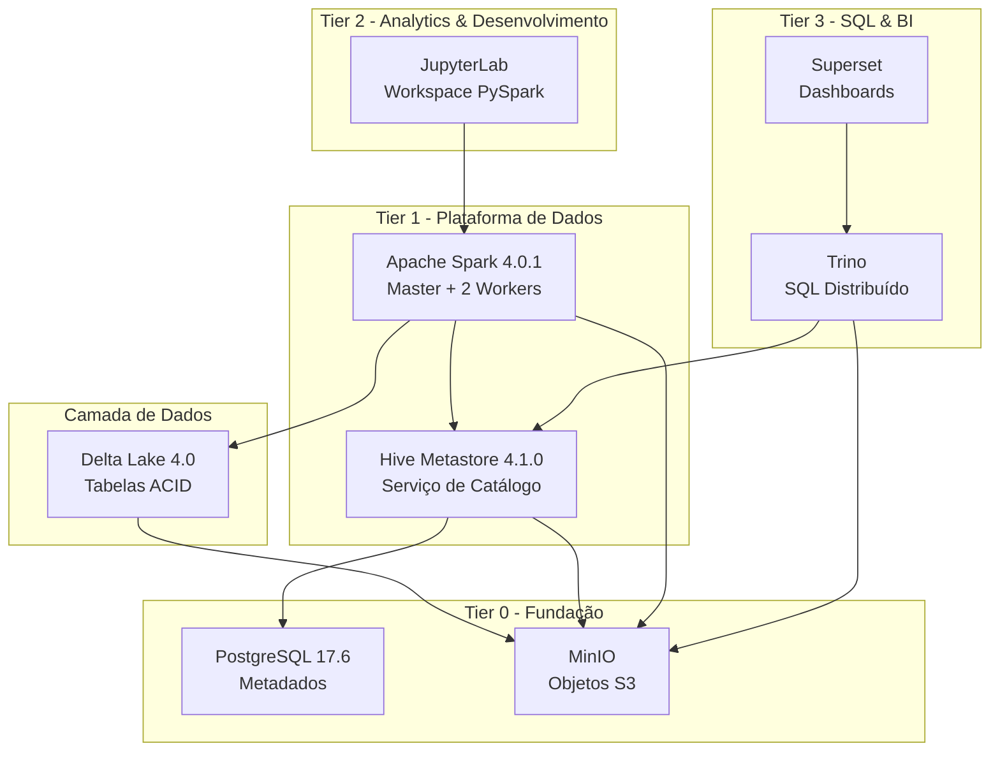

# FlumenData

<p align="center">
  
</p>

<p align="center"><strong>Lakehouse componível baseado em Docker Compose • Spark 4 + Delta Lake 4 • Trino & Superset</strong></p>

<p align="center">
  <a href="#-inicio-rapido">Início rápido</a> ·
  <a href="#-arquitetura">Arquitetura</a> ·
  <a href="#-sistema-de-marca">Sistema de marca</a> ·
  <a href="./README.md">English</a>
</p>

<p align="center">
  
  
  
</p>

## 🎯 Visão Geral

FlumenData é uma **plataforma lakehouse open-source** que combina o melhor de data lakes e data warehouses. Construída com Docker Compose, fornece um ambiente completo e reproduzível para engenharia de dados e análises modernas.

**Status Atual:**
- ✅ **Tier 0 (Fundação)**: PostgreSQL, MinIO - validado e estável
- ✅ **Tier 1 (Plataforma de Dados)**: Apache Spark 4.0.1, Hive Metastore 4.1.0, Delta Lake 4.0 - operacional
- ✅ **Tier 2 (Analytics & Desenvolvimento)**: JupyterLab - pronto para uso diário
- ✅ **Tier 3 (SQL & BI)**: Trino, Superset - otimizados para portfólio

## ✨ Recursos Principais

- **Transações ACID**: Delta Lake fornece garantias ACID em armazenamento de objetos
- **Viagem no Tempo**: Consulte versões históricas dos seus dados
- **Evolução de Schema**: Adapte schemas sem quebrar pipelines existentes
- **Armazenamento Compatível com S3**: MinIO para armazenamento de objetos escalável
- **Hive Metastore**: Catálogo padrão da indústria com namespace de 2 níveis
- **Computação Distribuída**: Cluster Apache Spark (1 Master + 2 Workers)
- **Configuração com Um Comando**: `make init` inicia toda a plataforma

## 🏗️ Arquitetura



### Stack Tecnológico

| Camada | Tecnologia | Versão | Propósito |
|--------|-----------|--------|-----------|
| **Armazenamento** | MinIO | RELEASE.2025-09-07 | Armazenamento de objetos compatível com S3 |
| **Armazenamento** | Delta Lake | 4.0.0 | Formato de tabela ACID com viagem no tempo |
| **Metadados** | Hive Metastore | 4.1.0 | Catálogo centralizado |
| **Metadados** | PostgreSQL | 17.6 | Backend de metadados |
| **Computação** | Apache Spark | 4.0.1 | Motor de consultas distribuído |
| **Analytics** | JupyterLab | spark-4.0.1 | Notebooks PySpark |
| **SQL** | Trino | 450 | Motor SQL distribuído |
| **BI** | Superset | 5.0.0 | Dashboards e exploração de dados |

## 🚀 Início Rápido

### Pré-requisitos

- Docker 20.10+
- Docker Compose 2.0+
- GNU Make
- 16 GB RAM mínimo (32 GB recomendado)
- 20 GB de espaço livre em disco

### Instalação

```bash
# 1. Clone o repositório
git clone https://github.com/lucianomauda/FlumenData.git
cd FlumenData

# 2. Inicialize o ambiente
make init

# 3. Verifique que todos os serviços estão saudáveis
make health

# 4. Visualize o resumo do ambiente
make summary
```

### Sua Primeira Consulta

```bash
# Abra o shell Spark SQL
make shell-spark-sql

# Crie um database
CREATE DATABASE quickstart
LOCATION 's3a://lakehouse/warehouse/quickstart.db';

# Crie uma tabela Delta
CREATE TABLE quickstart.customers (
  id BIGINT,
  name STRING,
  email STRING
) USING DELTA;

# Insira dados
INSERT INTO quickstart.customers VALUES
  (1, 'Alice', 'alice@example.com'),
  (2, 'Bob', 'bob@example.com');

# Consulte dados
SELECT * FROM quickstart.customers;
```

## 📊 Interfaces Web

Após executar `make init`, acesse:

- **Interface Spark Master**: http://localhost:8080 - Status do cluster e monitoramento de jobs
- **Console MinIO**: http://localhost:9001 - Gerenciamento de armazenamento de objetos
  - Usuário: `minioadmin`
  - Senha: `minioadmin123`
  - Buckets: `lakehouse` (tabelas Delta) e `storage` (arquivos para ingestão)
- **JupyterLab**: http://localhost:8888 - Notebooks para exploração de dados (`make token-jupyterlab` para obter o token)
- **Console Trino**: http://localhost:${TRINO_PORT} - Histórico e status de consultas
- **Superset**: http://localhost:${SUPERSET_PORT} - Dashboards de BI (login: `admin` / `admin123`)

## 📖 Documentação

Documentação abrangente está disponível em Inglês e Português:

- **English**: [docs/index.md](docs/index.md)
- **Português**: [docs/index.pt.md](docs/index.pt.md)

Páginas principais de documentação:
- [Guia de Instalação](docs/getting-started/installation.md)
- [Tutorial Início Rápido](docs/getting-started/quickstart.md)
- [Arquitetura Detalhada](docs/getting-started/architecture.md)
- [Hive Metastore](docs/services/hive.md)
- [Apache Spark](docs/services/spark.md)
- [Apache Superset](docs/services/superset.md)
- [Configuração](docs/configuration/environment.md)
- [Referência de Comandos Make](docs/configuration/commands.md)

## 🛠️ Comandos Comuns

```bash
# Gerenciamento de Serviços
make init              # Inicialização completa
make up                # Iniciar todos os serviços
make up-tier2          # Iniciar serviços de analytics & automação
make up-tier3          # Iniciar serviços de SQL & BI
make build-superset    # Construir imagem do Superset com dependências
make down              # Parar todos os serviços
make restart           # Reiniciar todos os serviços

# Verificações de Saúde
make health            # Verificar todos os serviços
make health-tier0      # Verificar serviços de fundação
make health-tier1      # Verificar serviços de plataforma de dados
make health-tier2      # Verificar serviços de analytics & automação
make health-tier3      # Verificar serviços de SQL & BI

# Testes
make test              # Executar todos os testes
make test-tier0        # Testar serviços Tier 0
make test-tier1        # Testar serviços Tier 1
make test-tier2        # Testar serviços Tier 2
make test-tier3        # Testar serviços Tier 3

# Shells Interativos
make shell-spark       # Shell Spark Scala
make shell-pyspark     # Shell PySpark Python
make shell-spark-sql   # Shell Spark SQL
make shell-postgres    # Shell PostgreSQL
make sql-trino         # CLI do Trino
make mc                # Cliente MinIO

# Manutenção
make logs              # Ver todos os logs
make summary           # Visão geral do ambiente
make reset             # Resetar e reinicializar
make clean             # Remover tudo (DESTRUTIVO)
```

## 🎨 Sistema de Marca

| Token | Hex | Uso |
|-------|-----|-----|
| **FD Dark** | `#14171C` | Fundos de destaque, trechos em modo escuro |
| **FD Cyan (Trino)** | `#20EFFD` | Referências ao Trino, destaques de consulta |
| **FD Orange (JupyterLab)** | `#FDA931` | Badges de JupyterLab e experimentação |
| **FD Blue / Teal (Superset)** | `#0082C8` | Elementos de BI / Superset |
| **FD Lime** | `#B8E762` | Estados “healthy/running” |
| **FD Teal Deep** | `#157983` | Serviços fundacionais (PostgreSQL/MinIO) e navegação |
| **FD Light** | `#F5F7FB` | Fundos neutros, cards |
| **FD Gray / Dark** | `#9CA3AF` / `#4B5563` | Texto secundário e estados neutros |

- Respeite o mapeamento por serviço: **JupyterLab → laranja**, **Trino → ciano**, **Superset → azul/teal**, **fundação** → teal com detalhes em lime.
- Use lime para “saudável/em execução” e cinza para neutro/inativo.
- Limite diagramas a 2–3 cores vibrantes para manter clareza.

## ✏️ Tipografia & Ativos

| Contexto | Fonte | Observações |
|----------|-------|-------------|
| Títulos / logotipo | Space Grotesk (700 para H1, 600 para H2/H3) | Fonte de identidade usada no README e no MkDocs |
| Corpo do texto | Inter (400/500) | Aplicada via `docs/assets/styles/brand.css` |
| Código & configurações | JetBrains Mono (fallback: Fira Code) | Comandos, SQL, YAML e docker-compose |

- A documentação carrega essas fontes e a paleta via `docs/assets/styles/brand.css`.
- Utilize os logos em `docs/assets/images/` (`flumendata-logowithname.png`, `flumendata-logoonly.png`, `flumendata.ico`) para heróis, diagramas e favicons.
- Em badges e cards, mantenha a paleta para preservar a identidade visual.

## 📁 Estrutura do Projeto

```
FlumenData/
├── config/                     # Configuração gerada (NÃO EDITAR)
├── docker/                     # Dockerfiles customizados
│   ├── hive.Dockerfile        # Hive Metastore + PostgreSQL JDBC
│   ├── spark.Dockerfile       # Spark com verificações de saúde
│   └── superset.Dockerfile    # Superset com psycopg2 + sqlalchemy-trino
├── docs/                       # Documentação MkDocs Material (EN + PT)
├── makefiles/                  # Makefiles específicos de serviços
│   ├── postgres.mk
│   ├── minio.mk
│   ├── hive.mk
│   ├── spark.mk
│   ├── jupyterlab.mk
│   ├── trino.mk
│   └── superset.mk
├── templates/                  # Templates de configuração
│   ├── hive/
│   ├── spark/
│   ├── minio/
│   ├── jupyterlab/
│   ├── trino/
│   └── superset/
├── .env                        # Variáveis de ambiente (não no git)
├── docker-compose.tier0.yml    # Serviços de fundação
├── docker-compose.tier1.yml    # Serviços de plataforma de dados
├── docker-compose.tier2.yml    # Serviços de analytics & desenvolvimento
├── docker-compose.tier3.yml    # Serviços de orquestração & BI
├── Makefile                    # Orquestração principal
├── mkdocs.yml                 # Configuração da documentação
└── README_PT.md                # Este arquivo
```

## 🎓 Casos de Uso

FlumenData é perfeito para:

- **Aprendizado**: Entender arquitetura lakehouse moderna na prática
- **Desenvolvimento**: Construir e testar pipelines de dados localmente
- **Prototipagem**: Experimentar com Delta Lake e Spark
- **Treinamento**: Ensinar conceitos de engenharia de dados
- **POCs**: Provar conceitos antes de implantação em produção

## 🔄 Roteiro

- ✅ **Tier 0 – Fundação**: PostgreSQL, MinIO
- ✅ **Tier 1 – Plataforma de Dados**: Spark, Hive Metastore, Delta Lake
- ✅ **Tier 2 – Analytics & Desenvolvimento**: JupyterLab
- ✅ **Tier 3 – SQL & BI**: Trino, Superset

Diretrizes principais:
- Todo código e comentários em inglês
- Atualizar documentação EN e PT
- Executar `make test` antes de submeter
- Seguir estrutura de código existente

## 📝 Convenções

- **Gerenciamento de Configuração**: Sempre edite templates em `templates/`, nunca edite arquivos gerados em `config/`
- **Requisitos de Serviço**: Todo serviço deve ter healthcheck, volumes nomeados e configuração estática
- **Documentação**: Mantida em inglês e português
- **Commits**: Use formato de commits convencionais (ex: `feat(spark): add Delta Lake 4.0 support`)

## 🐛 Solução de Problemas

### Serviços não iniciando

```bash
# Verificar recursos do Docker
docker stats

# Ver logs
make logs

# Verificar saúde
make health
```

### Problemas de configuração

```bash
# Regenerar todas as configs
make config

# Reiniciar serviços
make restart
```

### Problemas com dados

```bash
# Reset completo (mantém dados)
make reset

# Opção nuclear (deleta tudo)
make clean
```

Para mais dicas de solução de problemas, veja a [documentação](docs/getting-started/installation.md#troubleshooting-installation).

## 🙏 Agradecimentos

FlumenData é construído sobre incríveis projetos open-source:
- [Apache Spark](https://spark.apache.org/)
- [Delta Lake](https://delta.io/)
- [Apache Hive](https://hive.apache.org/)
- [MinIO](https://min.io/)
- [PostgreSQL](https://www.postgresql.org/)
- [Trino](https://trino.io/)
- [Apache Superset](https://superset.apache.org/)
- [Project Jupyter](https://jupyter.org/)

## 📧 Contato

- **Issues**: https://github.com/lucianomauda/FlumenData/issues
- **Discussões**: https://github.com/lucianomauda/FlumenData/discussions

---

**FlumenData** - Lakehouse open, reproduzível e moderno para todos 🚀
