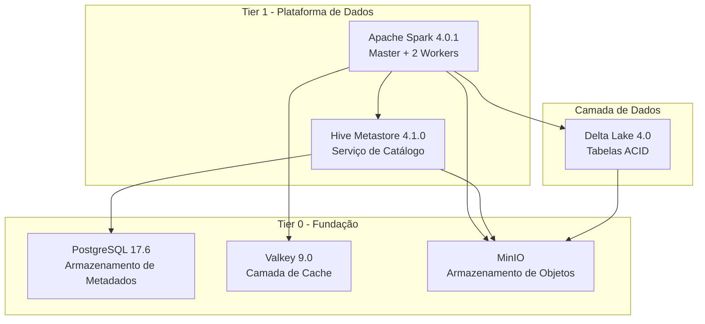

# FlumenData

> Um ambiente **Lakehouse** open-source, reproduzível, baseado em Docker Compose.
> Inicie tudo com um único comando: `make init`.

[This README is also available in English](./README.md)

[](https://opensource.org/licenses/Apache-2.0)
[](https://www.docker.com/)
[](https://spark.apache.org/)
[](https://delta.io/)

## 🎯 Visão Geral

FlumenData é uma **plataforma lakehouse open-source** que combina o melhor de data lakes e data warehouses. Construída com Docker Compose, fornece um ambiente completo e reproduzível para engenharia de dados e análises modernas.

**Status Atual:**
- ✅ **Tier 0 (Fundação)**: PostgreSQL, Valkey, MinIO - validado e estável
- ✅ **Tier 1 (Plataforma de Dados)**: Apache Spark 4.0.1, Hive Metastore 4.1.0, Delta Lake 4.0 - operacional

## ✨ Recursos Principais

- **Transações ACID**: Delta Lake fornece garantias ACID em armazenamento de objetos
- **Viagem no Tempo**: Consulte versões históricas dos seus dados
- **Evolução de Schema**: Adapte schemas sem quebrar pipelines existentes
- **Armazenamento Compatível com S3**: MinIO para armazenamento de objetos escalável
- **Hive Metastore**: Catálogo padrão da indústria com namespace de 2 níveis
- **Computação Distribuída**: Cluster Apache Spark (1 Master + 2 Workers)
- **Configuração com Um Comando**: `make init` inicia toda a plataforma

## 🏗️ Arquitetura



### Stack Tecnológico

| Camada | Tecnologia | Versão | Propósito |
|--------|-----------|--------|-----------|
| **Armazenamento** | MinIO | 2025-09-07 | Armazenamento de objetos compatível com S3 |
| **Armazenamento** | Delta Lake | 4.0.0 | Formato de tabela ACID com viagem no tempo |
| **Metadados** | Hive Metastore | 4.1.0 | Catálogo centralizado |
| **Metadados** | PostgreSQL | 17.6 | Backend de metadados |
| **Computação** | Apache Spark | 4.0.1 | Motor de consultas distribuído |
| **Cache** | Valkey | 9.0.0 | Cache em memória |

## 🚀 Início Rápido

### Pré-requisitos

- Docker 20.10+
- Docker Compose 2.0+
- GNU Make
- 8 GB RAM mínimo (16 GB recomendado)
- 20 GB de espaço livre em disco

### Instalação

```bash
# 1. Clone o repositório
git clone https://github.com/flumendata/flumendata.git
cd flumendata

# 2. Inicialize o ambiente
make init

# 3. Verifique que todos os serviços estão saudáveis
make health

# 4. Visualize o resumo do ambiente
make summary
```

### Sua Primeira Consulta

```bash
# Abra o shell Spark SQL
make shell-spark-sql

# Crie um database
CREATE DATABASE quickstart
LOCATION 's3a://lakehouse/warehouse/quickstart.db';

# Crie uma tabela Delta
CREATE TABLE quickstart.customers (
  id BIGINT,
  name STRING,
  email STRING
) USING DELTA;

# Insira dados
INSERT INTO quickstart.customers VALUES
  (1, 'Alice', 'alice@example.com'),
  (2, 'Bob', 'bob@example.com');

# Consulte dados
SELECT * FROM quickstart.customers;
```

## 📊 Interfaces Web

Após executar `make init`, acesse:

- **Interface Spark Master**: http://localhost:8080 - Status do cluster e monitoramento de jobs
- **Console MinIO**: http://localhost:9001 - Gerenciamento de armazenamento de objetos
  - Usuário: `minioadmin`
  - Senha: `minioadmin123`
- **JupyterLab**: http://localhost:8888 - Notebooks para exploração de dados (`make token-jupyterlab` para obter o token)
- **MLflow Tracking UI**: http://localhost:${MLFLOW_PORT} - Painel de rastreamento de experimentos

## 📖 Documentação

Documentação abrangente está disponível em Inglês e Português:

- **English**: [docs/en/](docs/en/index.md)
- **Português**: [docs/pt/](docs/pt/index.md)

Páginas principais de documentação:
- [Guia de Instalação](docs/en/getting-started/installation.md)
- [Tutorial Início Rápido](docs/en/getting-started/quickstart.md)
- [Arquitetura Detalhada](docs/en/getting-started/architecture.md)
- [Hive Metastore](docs/pt/services/hive.md)
- [Apache Spark](docs/pt/services/spark.md)
- [Configuração](docs/en/configuration/environment.md)
- [Referência de Comandos Make](docs/en/configuration/commands.md)
- [Guia de Contribuição](docs/en/development/contributing.md)

## 🛠️ Comandos Comuns

```bash
# Gerenciamento de Serviços
make init              # Inicialização completa
make up                # Iniciar todos os serviços
make down              # Parar todos os serviços
make restart           # Reiniciar todos os serviços

# Verificações de Saúde
make health            # Verificar todos os serviços
make health-tier0      # Verificar serviços de fundação
make health-tier1      # Verificar serviços de plataforma de dados

# Testes
make test              # Executar todos os testes
make test-tier0        # Testar serviços Tier 0
make test-tier1        # Testar serviços Tier 1

# Shells Interativos
make shell-spark       # Shell Spark Scala
make shell-pyspark     # Shell PySpark Python
make shell-spark-sql   # Shell Spark SQL
make shell-postgres    # Shell PostgreSQL
make mc                # Cliente MinIO

# Manutenção
make logs              # Ver todos os logs
make summary           # Visão geral do ambiente
make reset             # Resetar e reinicializar
make clean             # Remover tudo (DESTRUTIVO)
```

## 📁 Estrutura do Projeto

```
FlumenData/
├── config/                     # Configuração gerada (NÃO EDITAR)
├── docker/                     # Dockerfiles customizados
│   ├── hive.Dockerfile        # Hive Metastore + PostgreSQL JDBC
│   └── spark.Dockerfile        # Spark com verificações de saúde
├── docs/                       # Documentação MkDocs Material
│   ├── en/                    # Documentação em inglês
│   └── pt/                    # Documentação em português
├── makefiles/                  # Makefiles específicos de serviços
│   ├── postgres.mk
│   ├── valkey.mk
│   ├── minio.mk
│   ├── hive.mk
│   └── spark.mk
├── templates/                  # Templates de configuração
│   ├── hive/
│   ├── spark/
│   ├── minio/
│   └── valkey/
├── .env                        # Variáveis de ambiente (não no git)
├── docker-compose.tier0.yml    # Serviços de fundação
├── docker-compose.tier1.yml    # Serviços de plataforma de dados
├── Makefile                    # Orquestração principal
├── mkdocs.yml                 # Configuração da documentação
└── README_PT.md                # Este arquivo
```

## 🎓 Casos de Uso

FlumenData é perfeito para:

- **Aprendizado**: Entender arquitetura lakehouse moderna na prática
- **Desenvolvimento**: Construir e testar pipelines de dados localmente
- **Prototipagem**: Experimentar com Delta Lake e Spark
- **Treinamento**: Ensinar conceitos de engenharia de dados
- **POCs**: Provar conceitos antes de implantação em produção

## 🔄 Roteiro

- ✅ **Tier 0 – Fundação**: PostgreSQL, Valkey, MinIO
- ✅ **Tier 1 – Plataforma de Dados**: Spark, Hive Metastore, Delta Lake
- 🔄 **Tier 2 – Desenvolvimento & ML**: JupyterLab, dbt, MLflow
- 📋 **Tier 3 – Orquestração & BI**: Airflow, Trino, Superset
- 📋 **Tier 4 – Observabilidade**: Prometheus, Grafana

## 🤝 Contribuindo

Contribuições são bem-vindas! Por favor, veja nosso [Guia de Contribuição](docs/en/development/contributing.md) para detalhes.

Diretrizes principais:
- Todo código e comentários em inglês
- Atualizar documentação EN e PT
- Executar `make test` antes de submeter
- Seguir estrutura de código existente

## 📝 Convenções

- **Gerenciamento de Configuração**: Sempre edite templates em `templates/`, nunca edite arquivos gerados em `config/`
- **Requisitos de Serviço**: Todo serviço deve ter healthcheck, volumes nomeados e configuração estática
- **Documentação**: Mantida em inglês e português
- **Commits**: Use formato de commits convencionais (ex: `feat(spark): add Delta Lake 4.0 support`)

## 🐛 Solução de Problemas

### Serviços não iniciando

```bash
# Verificar recursos do Docker
docker stats

# Ver logs
make logs

# Verificar saúde
make health
```

### Problemas de configuração

```bash
# Regenerar todas as configs
make config

# Reiniciar serviços
make restart
```

### Problemas com dados

```bash
# Reset completo (mantém dados)
make reset

# Opção nuclear (deleta tudo)
make clean
```

Para mais dicas de solução de problemas, veja a [documentação](docs/en/getting-started/installation.md#troubleshooting-installation).

## 📄 Licença

FlumenData está licenciado sob [Apache License 2.0](LICENSE).

## 🙏 Agradecimentos

FlumenData é construído sobre incríveis projetos open-source:
- [Apache Spark](https://spark.apache.org/)
- [Delta Lake](https://delta.io/)
- [Apache Hive](https://hive.apache.org/)
- [MinIO](https://min.io/)
- [PostgreSQL](https://www.postgresql.org/)
- [Valkey](https://valkey.io/)

## 📧 Contato

- **Issues**: https://github.com/flumendata/flumendata/issues
- **Discussões**: https://github.com/flumendata/flumendata/discussions

---

**FlumenData** - Lakehouse open, reproduzível e moderno para todos 🚀
