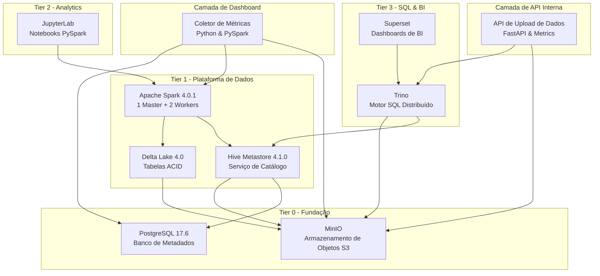

# FlumenData

<p align="center">
  
</p>

<p align="center"><strong>Plataforma Lakehouse Pronta para Produção • Spark 4 + Delta Lake 4 • Docker Compose • Pronto em 5 minutos</strong></p>

<p align="center">
  <a href="#-inicio-rapido">Início Rápido</a> ·
  <a href="docs/getting-started/installation.pt.md">Instalação</a> ·
  <a href="docs/">Documentação</a> ·
  <a href="./README.md">English</a>
</p>

<p align="center">
  
  
  
  
  
</p>

---

## 🎯 O que é FlumenData?

**FlumenData** é uma plataforma lakehouse open-source que combina o melhor de data lakes e data warehouses. Construída com Docker Compose, fornece um ambiente completo e pronto para produção para engenharia de dados e análises modernas.

**Perfeito para:**
- Aprender Delta Lake e Apache Spark 4
- Construir pipelines de dados com garantias ACID
- Projetos de portfólio e demos de ciência de dados
- Desenvolvimento local antes da implantação na nuvem

**Status de Produção:**
- ✅ **Fundação** (PostgreSQL, MinIO) - Estável
- ✅ **Plataforma de Dados** (Spark 4, Hive, Delta Lake 4) - Pronto para produção
- ✅ **Analytics** (JupyterLab) - Pronto para uso diário
- ✅ **SQL & BI** (Trino, Superset) - Pronto para demos

---

## ✨ Recursos Principais

- **🔒 Transações ACID** - Garantias Delta Lake em armazenamento de objetos
- **⏰ Viagem no Tempo (Time Travel)** - Consulte versões históricas e reverta alterações
- **🔄 Evolução de Schema** - Adapte schemas sem quebrar pipelines
- **📦 Compatível com S3** - MinIO para armazenamento de objetos escalável
- **📚 Hive Metastore** - Catálogo padrão da indústria (database.table)
- **⚡ Computação Distribuída** - Cluster Spark (1 Master + 2 Workers)
- **🖥️ Multi-Plataforma** - Funciona em Windows, Linux e macOS
- **🚀 Configuração com Um Comando** - `make init` e está funcionando

---

## 🏗️ Arquitetura



### Stack Tecnológico

| Componente | Tecnologia | Versão | Propósito |
|------------|-----------|--------|-----------|
| **Computação** | Apache Spark | 4.0.1 | Motor de processamento distribuído |
| **Formato** | Delta Lake | 4.0.0 | Tabelas ACID com viagem no tempo |
| **Catálogo** | Hive Metastore | 4.1.0 | Catálogo de metadados centralizado |
| **Armazenamento** | MinIO | 2025.09 | Armazenamento de objetos compatível com S3 |
| **Metadados** | PostgreSQL | 17.6 | Backend de metadados relacional |
| **Analytics** | JupyterLab | Latest | Workspace PySpark |
| **SQL** | Trino | 450 | Consultas SQL distribuídas |
| **BI** | Superset | 5.0.0 | Análises visuais e dashboards |
| **Coletor** | Python | 3.13 | Coleta de métricas e metadados |
| **API** | FastAPI | latest | Ingestão de dados e acesso a métricas |

---

## 🚀 Início Rápido

### Pré-requisitos

- **Docker** 20.10+ & **Docker Compose** 2.0+
- **Python** 3.6+
- **8GB RAM** mínimo (16GB recomendado)
- **20GB de espaço** em disco

> **📖 Guia de instalação detalhado:** [docs/getting-started/installation.pt.md](docs/getting-started/installation.pt.md)

### Instalação & Execução

```bash
# 1. Clone o repositório
git clone https://github.com/lucianomauda/FlumenData.git
cd FlumenData

# 2. Inicialize tudo (constrói imagens, inicia serviços, executa verificações de saúde)
make init

# 3. Abra o JupyterLab e execute o notebook de início rápido
open http://localhost:8888
```

**É isso!** ✨ Todo o lakehouse está funcionando agora.

---

## 📚 Acesse Seus Serviços

| Serviço | URL | Credenciais |
|---------|-----|-------------|
| **JupyterLab** | http://localhost:8888 | Sem senha |
| **Interface Spark Master** | http://localhost:8080 | - |
| **Console MinIO** | http://localhost:9001 | admin / admin123 |
| **Trino** | http://localhost:8082 | - |
| **Superset** | http://localhost:8088 | admin / admin123 |

---

## 📖 Documentação

- **[Guia de Instalação](docs/getting-started/installation.pt.md)** - Configuração detalhada para Windows/Linux/macOS
- **[Início Rápido](docs/getting-started/quickstart.pt.md)** - Sua primeira tabela Delta Lake em 5 minutos
- **[Arquitetura](docs/getting-started/architecture.md)** - Como todos os componentes funcionam juntos
- **[Referência CLI](docs/configuration/commands.pt.md)** - Documentação completa de comandos
- **[Guias de Serviços](docs/services/)** - Análises detalhadas de cada componente

---

## 🛠️ Comandos Comuns

```bash
# Gerenciamento de Serviços
make up              # Iniciar todos os serviços
make down            # Parar todos os serviços
make restart         # Reiniciar todos os serviços
make ps              # Mostrar status dos serviços

# Saúde & Monitoramento
make health          # Verificar saúde de todos os serviços
make logs            # Ver todos os logs
make logs-spark      # Ver logs de serviço específico

# Shells Interativos
make shell-pyspark   # Abrir shell PySpark
make shell-postgres  # Abrir shell PostgreSQL
make shell-mc        # Abrir shell do cliente MinIO

# Manutenção
make clean           # Parar serviços e remover volumes (⚠️ deleta dados)
make rebuild         # Reconstruir todas as imagens customizadas

# Dashboard & Métricas
make dashboard-collect   # Executar coleta de métricas (uma vez)
make dashboard-status    # Verificar o status do coletor
```

> **📖 Referência completa de comandos:** [docs/configuration/commands.pt.md](docs/configuration/commands.pt.md)

---

## 🤝 Contribuindo

Contribuições são bem-vindas! Sinta-se à vontade para enviar um Pull Request.

**Foco do Projeto:**
- Manter simples e reproduzível
- Garantir compatibilidade multi-plataforma
- Priorizar experiência do desenvolvedor
- Usar ferramentas padrão e prontas para produção

---

## 📄 Licença

Este projeto está licenciado sob a Licença MIT - veja o arquivo [LICENSE](LICENSE) para detalhes.

---

## 🙏 Agradecimentos

Construído com tecnologias open-source incríveis:
- [Apache Spark](https://spark.apache.org/)
- [Delta Lake](https://delta.io/)
- [Apache Hive](https://hive.apache.org/)
- [MinIO](https://min.io/)
- [Trino](https://trino.io/)
- [Apache Superset](https://superset.apache.org/)

---

## 💬 Comunidade & Suporte

- **Issues:** [Reportar bugs ou solicitar recursos](https://github.com/lucianomauda/FlumenData/issues)
- **Discussões:** [Fazer perguntas e compartilhar ideias](https://github.com/lucianomauda/FlumenData/discussions)
- **Autor:** [Luciano Mauda Junior](https://github.com/lucianomauda) | [LinkedIn](https://www.linkedin.com/in/lucianomaudajunior)
