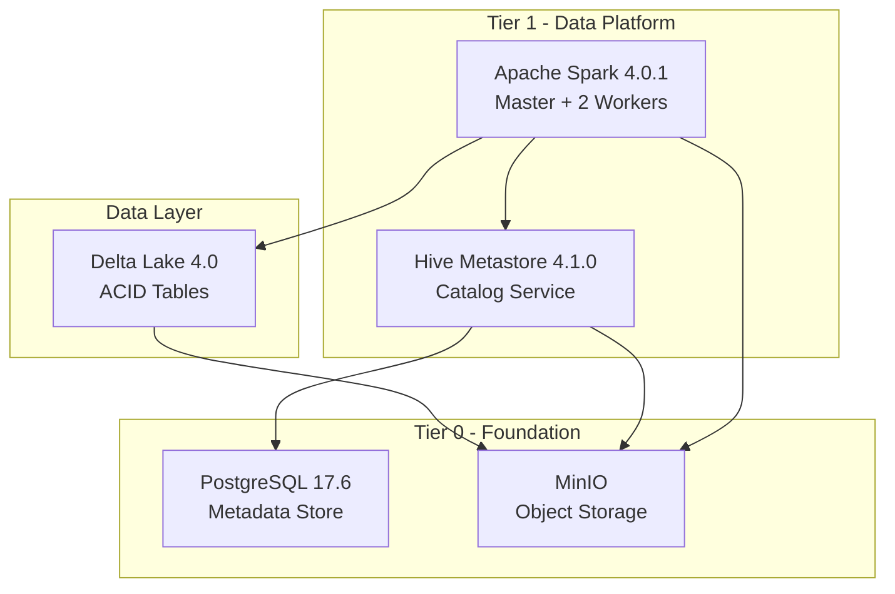
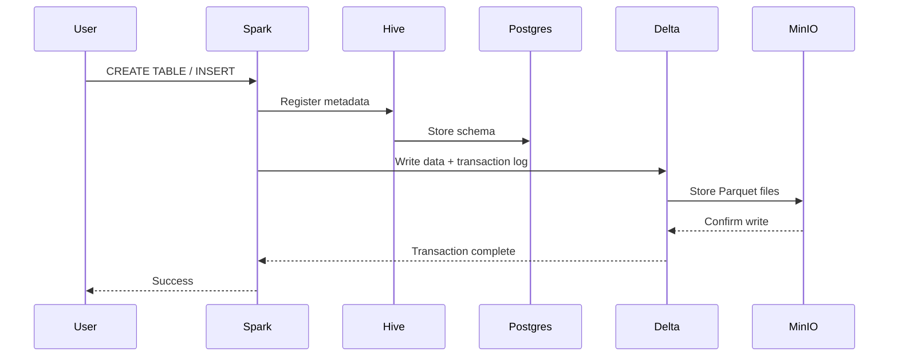
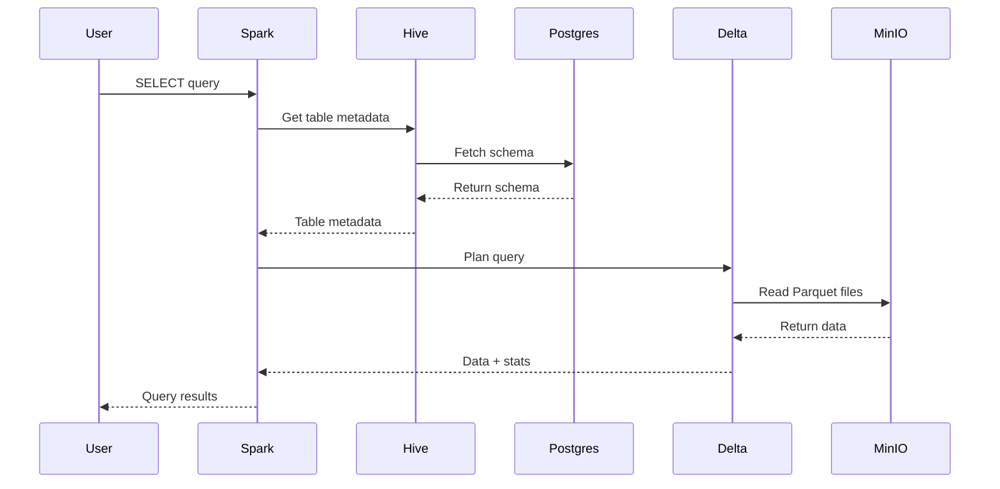
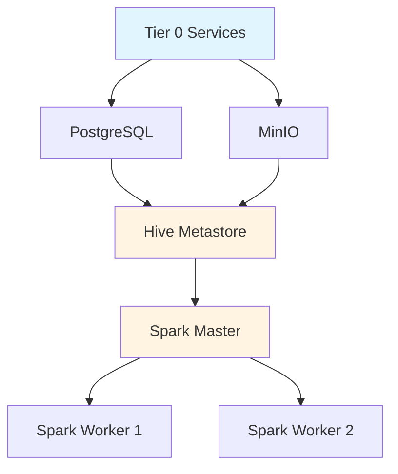

# Architecture

FlumenData implements a modern lakehouse architecture that combines the best features of data lakes and data warehouses.

## Overview



## Architecture Layers

### 1. Storage Layer (Tier 0)

#### MinIO - Object Storage
- **Purpose**: S3-compatible object storage for all table data
- **Technology**: MinIO (S3 API)
- **Port**: 9000 (API), 9001 (Console)
- **Data Format**: Parquet files organized by Delta Lake
- **Bucket Structure**:
  ```
  lakehouse/
  └── warehouse/
      ├── database1.db/
      │   ├── table1/
      │   └── table2/
      └── database2.db/
  ```

#### PostgreSQL - Metadata Backend
- **Purpose**: Store Hive Metastore metadata
- **Technology**: PostgreSQL 17.6
- **Port**: 5432
- **Stores**:
  - Database definitions
  - Table schemas
  - Partition information
  - Column statistics
  - Table locations (S3A paths)

### 2. Metadata Layer (Tier 1)

#### Hive Metastore
- **Purpose**: Centralized catalog for lakehouse
- **Technology**: Apache Hive 4.1.0 (standalone metastore)
- **Port**: 9083 (Thrift)
- **Architecture**:
  - Thrift service for metadata API
  - 2-level namespace: `database.table`
  - Metadata stored in PostgreSQL
  - Compatible with Spark, Trino, Presto
- **Key Features**:
  - ACID transaction metadata
  - Schema evolution tracking
  - Partition management
  - Statistics storage

### 3. Compute Layer (Tier 1)

#### Apache Spark Cluster
- **Purpose**: Distributed query and processing engine
- **Technology**: Apache Spark 4.0.1
- **Ports**: 7077 (Master), 8080 (UI)
- **Components**:
  - **Master Node**: Job coordination and scheduling
  - **Worker Nodes** (x2): Task execution
    - 2 CPU cores per worker
    - 2 GB memory per worker

### 4. Table Format Layer

#### Delta Lake
- **Purpose**: ACID table format with time travel
- **Technology**: Delta Lake 4.0
- **Features**:
  - ACID transactions
  - Schema evolution
  - Time travel
  - Audit history
  - Unified batch/streaming
- **Structure**:
  ```
  table/
  ├── _delta_log/
  │   ├── 00000000000000000000.json
  │   ├── 00000000000000000001.json
  │   └── _last_checkpoint
  └── part-*.parquet
  ```

## Data Flow

### 1. Write Path



**Steps:**
1. User submits SQL query to Spark
2. Spark contacts Hive Metastore for table metadata
3. Hive stores/updates schema in PostgreSQL
4. Spark writes data using Delta Lake format
5. Delta Lake writes Parquet files to MinIO
6. Delta Lake commits transaction log
7. Success returned to user

### 2. Read Path



**Steps:**
1. User submits SELECT query to Spark
2. Spark requests table metadata from Hive
3. Hive retrieves schema from PostgreSQL
4. Spark uses Delta Lake to plan optimal read
5. Delta Lake reads transaction log from MinIO
6. Delta Lake performs partition pruning
7. Only required Parquet files are read
8. Results returned to user

## Component Interactions

### Spark ↔ Hive Metastore
- **Protocol**: Thrift (port 9083)
- **Purpose**:
  - Table creation/deletion
  - Schema evolution
  - Partition management
  - Statistics collection

### Spark ↔ MinIO
- **Protocol**: S3A (HTTP on port 9000)
- **Purpose**:
  - Read/write Parquet files
  - Read Delta transaction logs
  - List partitions

### Hive ↔ PostgreSQL
- **Protocol**: JDBC
- **Purpose**:
  - Store table metadata
  - Schema versioning
  - Partition tracking

### Delta Lake ↔ MinIO
- **Protocol**: S3A
- **Purpose**:
  - ACID transaction logs
  - Parquet data files
  - Checkpoint files

## Deployment Architecture

### Docker Compose Tiers

**Tier 0 (Foundation):**
```yaml
postgres:      # Metadata backend
minio:         # Object storage
```

**Tier 1 (Data Platform):**
```yaml
hive-metastore:   # Catalog service
spark-master:     # Spark coordinator
spark-worker1:    # Spark executor
spark-worker2:    # Spark executor
```

**Tier 2 (Analytics & Development):**
```yaml
jupyterlab:    # PySpark workspace
```

**Tier 3 (SQL & BI):**
```yaml
trino:         # Distributed SQL engine
superset:      # BI dashboards
```

### Startup Dependencies



### Health Check Chain

All services have health checks to ensure proper startup:

1. **PostgreSQL**: `pg_isready` command
2. **MinIO**: HTTP GET on `/minio/health/live`
3. **Hive Metastore**: Process check `pgrep -f HiveMetaStore`
4. **Spark Master**: HTTP GET on port 8080
5. **Spark Workers**: Check Master UI accessibility

## Network Architecture

### Container Network
All services run on the same Docker network (`tier0_network` and `tier1_network`):

- **DNS**: Container names resolve to IP addresses
- **Internal Communication**: No encryption (TLS optional)
- **External Access**: Only selected ports exposed to host

### Port Mapping

| Service | Internal Port | External Port | Protocol |
| Service | Host Port | Container Port | Protocol |
|---------|-----------|----------------|----------|
| PostgreSQL | 5432 | 5432 | TCP |
| MinIO API | 9000 | 9000 | HTTP |
| MinIO Console | 9001 | 9001 | HTTP |
| Hive Metastore | 9083 | 9083 | Thrift |
| Spark Master | 7077 | 7077 | RPC |
| Spark Master UI | 8080 | 8080 | HTTP |
| JupyterLab | 8888 | 8888 | HTTP |
| Trino | ${TRINO_PORT:-8082} | 8080 | HTTP |
| Superset | ${SUPERSET_PORT:-8088} | 8088 | HTTP |

## Storage Architecture

### Bind Mounts (User-Accessible Data)

**Critical data directories mounted from `${DATA_DIR}`:**
```
${DATA_DIR}/minio/            # MinIO lakehouse storage (can grow to TBs)
  ├── lakehouse/              # Delta Lake tables
  └── storage/                # Staging bucket
${DATA_DIR}/notebooks/        # JupyterLab notebooks (version control this!)
```

These directories are on your host filesystem and can be:
- Backed up easily
- Accessed from Windows Explorer (if using WSL)
- Version controlled (especially notebooks/)

### Docker Volumes (Internal Data)

**Tier 0 Volumes:**
```
postgres_data    # PostgreSQL database files (Hive metadata)
```

**Tier 1 Volumes:**
```
spark_conf       # Spark configuration
spark_ivy        # JAR dependency cache
spark_work       # Spark work directory
spark_logs       # Spark logs
```

**Tier 3 Volumes:**
```
flumen_superset_home       # Superset dashboards, uploads, config
```

### Data Retention

- **Delta Lake**: Configurable retention (default 30 days)
- **Hive Metadata**: Retained indefinitely in PostgreSQL
- **Spark Logs**: Retained in volume (manual cleanup)
- **MinIO Objects**: Retained until explicitly deleted

## Scalability Considerations

### Current Setup
- 1 Spark Master
- 2 Spark Workers
- 1 Hive Metastore instance
- Single-node PostgreSQL

### Future Scaling Options
1. **Add more Spark Workers**: Scale compute horizontally
2. **Partition tables**: Improve query performance
3. **PostgreSQL High Availability**: Primary + replica
4. **Multiple Hive Metastore instances**: Load balancing
5. **Distributed MinIO**: Multi-node object storage

## Security Architecture

### Current Security
- **No encryption**: Internal communication unencrypted
- **Basic authentication**: MinIO username/password
- **Docker network isolation**: Services isolated from host network
- **No TLS**: HTTP only for web interfaces

### Production Considerations
- Enable TLS for all services
- Use secrets management (HashiCorp Vault, AWS Secrets Manager)
- Implement network policies
- Enable audit logging
- Use RBAC for access control

## High Availability

Current setup is **not high-available** - suitable for development only.

For production:
- PostgreSQL: Primary-replica setup with automatic failover
- Hive Metastore: Multiple instances behind load balancer
- MinIO: Distributed mode with erasure coding
- Spark: Multiple masters in HA mode

## Next Steps

- [Installation Guide](installation.md) - Deploy FlumenData
- [Quick Start](quickstart.md) - Create your first table
- [Configuration](../configuration/environment.md) - Customize the setup
