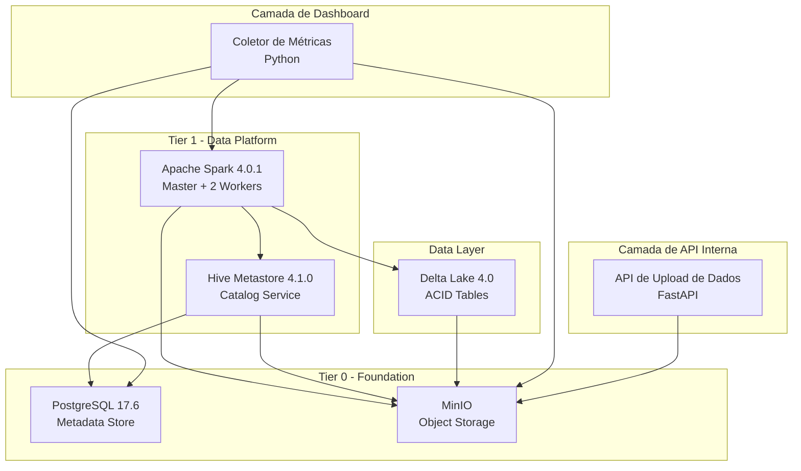
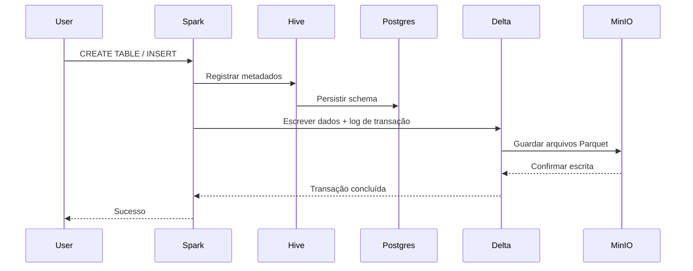
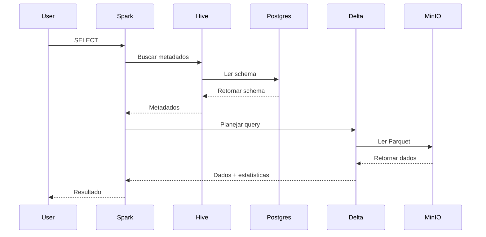

# Arquitetura

O FlumenData implementa uma arquitetura lakehouse moderna que combina o melhor dos data lakes e data warehouses.

## Visão Geral



## Camadas da Arquitetura

### 1. Camada de Armazenamento (Tier 0)

#### MinIO - Object Storage
- **Função:** armazenamento de objetos compatível com S3 para todas as tabelas
- **Tecnologia:** MinIO (API S3)
- **Portas:** 9000 (API) e 9001 (Console)
- **Formato:** arquivos Parquet organizados pelo Delta Lake
- **Estrutura de buckets:**
  ```
  lakehouse/
  └── warehouse/
      ├── database1.db/
      │   ├── table1/
      │   └── table2/
      └── database2.db/
  ```

#### PostgreSQL - Backend de Metadados
- **Função:** armazenar o catálogo do Hive Metastore
- **Tecnologia:** PostgreSQL 17.6
- **Porta:** 5432
- **Armazena:**
  - Definições de banco e tabela
  - Schemas e partições
  - Estatísticas e locais (paths S3A)

### 2. Camada de Metadados (Tier 1)

#### Hive Metastore
- **Função:** catálogo centralizado do lakehouse
- **Tecnologia:** Apache Hive 4.1.0 (metastore standalone)
- **Porta:** 9083 (Thrift)
- **Arquitetura:**
  - API Thrift para metadados
  - Namespace em 2 níveis (`database.table`)
  - Metadados persistidos no PostgreSQL
  - Compatível com Spark, Trino, Presto
- **Recursos:** transações ACID, evolução de schema, gerenciamento de partições, estatísticas

### 3. Camada de Computação (Tier 1)

#### Cluster Apache Spark
- **Função:** engine distribuída para consultas e processamento
- **Tecnologia:** Apache Spark 4.0.1
- **Portas:** 7077 (Master) e 8080 (UI)
- **Componentes:**
  - **Master:** coordenação e agendamento de jobs
  - **Workers (x2):** executam tarefas com 2 vCPUs e 2 GB de RAM cada

### 4. Camada de Formato de Tabelas

#### Delta Lake
- **Função:** formato ACID com time travel
- **Tecnologia:** Delta Lake 4.0
- **Recursos:** ACID, evolução de schema, histórico de versões, unificação batch/streaming
- **Estrutura:**
  ```
  table/
  ├── _delta_log/
  │   ├── 00000000000000000000.json
  │   ├── 00000000000000000001.json
  │   └── _last_checkpoint
  └── part-*.parquet
  ```

## Fluxo de Dados

### 1. Escrita



1. Usuário envia consulta para o Spark
2. Spark consulta o Hive Metastore
3. Hive grava/atualiza metadados no PostgreSQL
4. Spark grava usando o formato Delta Lake
5. Arquivos Parquet vão para o MinIO
6. Delta registra o log (_delta_log)
7. Resultado é retornado

### 2. Leitura



1. Usuário executa SELECT
2. Spark consulta o Hive Metastore (schema no PostgreSQL)
3. Delta Lake lê o log para planejar
4. Apenas as partições necessárias são lidas do MinIO
5. Resultado é retornado

## Interações entre Componentes

### Spark ↔ Hive Metastore
- Protocolo Thrift (9083)
- Criação de tabelas, evolução de schema, partições, estatísticas

### Spark ↔ MinIO
- Protocolo S3A (HTTP na porta 9000)
- Leitura/escrita de Parquet e logs Delta

### Hive ↔ PostgreSQL
- Protocolo JDBC
- Persistência de metadados, partições e versões de schema

### Delta Lake ↔ MinIO
- Leiaute ACID (_delta_log) + arquivos Parquet
- Time travel e transações dependem da integridade do bucket `lakehouse`
