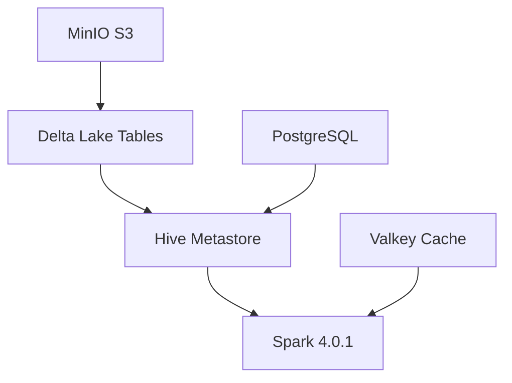

# FlumenData

> A reproducible, Docker Compose–based open‑source **Lakehouse** environment.
> Start everything with a single command: `make init`.

!!! tip "Project Status"
    **Tier 0 is validated**: PostgreSQL, Valkey and MinIO are up with healthchecks, named volumes and config under `/config`.
    **Tier 1 is operational**: Apache Spark 4.0.1, Hive Metastore 4.1.0, and Delta Lake 4.0 are deployed and tested.

## Quickstart

```bash
# 1) Clone the repository
git clone https://github.com/flumendata/flumendata.git
cd flumendata

# 2) Initialize the complete environment
make init

# 3) Verify all services are healthy
make health

# 4) View environment summary
make summary
```

## Architecture

FlumenData implements a modern lakehouse architecture with:



### Technology Stack

**Storage Layer:**
- **MinIO** - S3-compatible object storage for the data lake
- **Delta Lake 4.0** - ACID table format with time travel capabilities

**Metadata Layer:**
- **Hive Metastore 4.1.0** - Industry-standard catalog (2-level namespace: database.table)
- **PostgreSQL** - Backend for Hive Metastore metadata

**Compute Layer:**
- **Apache Spark 4.0.1** - Distributed query and processing engine (Master + 2 Workers)

**Cache Layer:**
- **Valkey** - Redis-compatible in-memory cache

## Project Structure

```
/FlumenData/
├── config/             # Rendered configuration (auto-generated, do not edit)
├── docker/             # Custom Dockerfiles
├── docs/               # MkDocs Material documentation (EN + PT)
├── makefiles/          # Service-specific Makefile modules
├── templates/          # Configuration templates
├── .env                # Environment variables
├── docker-compose.tier0.yml  # Foundation services
├── docker-compose.tier1.yml  # Data platform services
└── Makefile            # Main orchestration
```

## Services

### Tier 0 - Foundation

- [**PostgreSQL 17.6**](services/postgres.md) – Relational metadata store
  `postgres:17.6-alpine3.22`

- [**Valkey 9.0.0**](services/valkey.md) – In-memory key/value store
  `valkey/valkey:9.0.0-alpine3.22`

- [**MinIO**](services/minio.md) – S3-compatible object storage
  `minio/minio:RELEASE.2025-09-07T16-13-09Z`

### Tier 1 - Data Platform

- [**Hive Metastore 4.1.0**](services/hive.md) – Lakehouse catalog
  Custom image: `flumendata/hive:standalone-metastore-4.1.0`

- [**Apache Spark 4.0.1**](services/spark.md) – Distributed compute engine
  Custom image: `flumendata/spark:4.0.1-health`

## Key Features

### Delta Lake Integration
- ACID transactions on object storage
- Time travel (historical queries)
- Schema evolution
- Unified batch and streaming

### Hive Metastore Catalog
- 2-level namespace (database.table)
- PostgreSQL backend for reliability
- Compatible with Spark, Presto, Trino
- Standard Thrift API (port 9083)

### Spark Cluster
- 1 Master + 2 Workers
- Pre-configured for Delta Lake
- S3A integration with MinIO
- Ivy cache for fast dependency resolution

## Make Commands

### Initialization
```bash
make init          # Complete environment setup
make config        # Generate all configuration files
make up            # Start all services
```

### Service Management
```bash
make up-tier0      # Start foundation services
make up-tier1      # Start data platform services
make down          # Stop all services
make restart       # Restart all services
```

### Health & Validation
```bash
make health        # Check all services health
make health-tier0  # Check Tier 0 services
make health-tier1  # Check Tier 1 services
```

### Testing
```bash
make test          # Run all tests
make test-tier0    # Test foundation services
make test-tier1    # Test data platform services
```

### Verification
```bash
make verify-hive   # Verify Hive Metastore setup
make summary       # Display environment summary
make ps            # Show running containers
```

### Logs
```bash
make logs          # Show logs for all services
make logs-tier0    # Show Tier 0 logs
make logs-tier1    # Show Tier 1 logs
make logs-spark    # Show Spark logs
make logs-hive     # Show Hive Metastore logs
```

### Development
```bash
make shell-postgres    # Open PostgreSQL shell
make shell-spark       # Open Spark shell
make shell-pyspark     # Open PySpark shell
make shell-spark-sql   # Open Spark SQL shell
make mc                # Open MinIO client
```

### Maintenance
```bash
make reset         # Complete reset and reinitialize
make clean         # Stop and remove all data (DANGEROUS)
```

## Conventions

- All **code and comments** are in **English**
- Configuration is generated via **Makefile** targets into `/config/` - never edit rendered files manually
- Every service must have a **healthcheck**, **named volumes**, and static config under `/config/`
- Documentation is maintained in both **English** (`/docs/en/`) and **Portuguese** (`/docs/pt/`)

## Web Interfaces

After running `make init`, access these UIs:

- **Spark Master UI**: http://localhost:8080
- **MinIO Console**: http://localhost:9001 (minioadmin / minioadmin123)
- **JupyterLab**: http://localhost:8888 (run `make token-jupyterlab` for access)
- **MLflow Tracking UI**: http://localhost:${MLFLOW_PORT}
- **Superset**: http://localhost:${SUPERSET_PORT} (login: `admin` / `admin123`)

## Roadmap

- ✅ **Tier 0 – Foundation**: PostgreSQL, Valkey, MinIO
- ✅ **Tier 1 – Data Platform**: Spark, Hive Metastore, Delta Lake
- 🔄 **Tier 2 – Development & ML**: JupyterLab, dbt, MLflow
- 🔄 **Tier 3 – Orchestration & BI**: Trino, Superset (Airflow next)
- 📋 **Tier 4 – Observability**: Prometheus, Grafana

## Contributing

See [Contributing Guide](development/contributing.md) for development guidelines.

## License

Apache License 2.0
