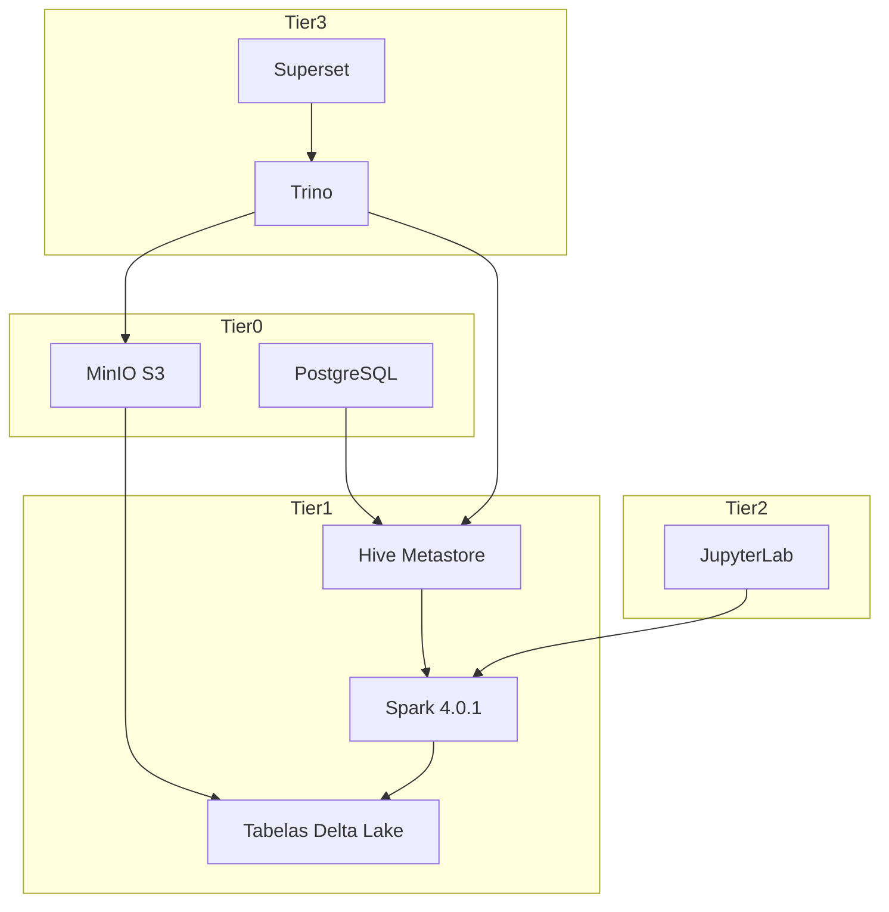

# FlumenData

<div class="fd-hero">
  
  <p>Lakehouse componível baseado em Docker Compose, unindo Spark 4, Delta Lake 4, Trino, Superset e MinIO.</p>
  <div class="fd-tags">
    <span class="fd-tag trino">Trino SQL</span>
    <span class="fd-tag jupiter">JupyterLab</span>
    <span class="fd-tag superset">Superset BI</span>
    <span class="fd-tag healthy">Tiers saudáveis</span>
  </div>
</div>

!!! tip "Status do Projeto"
    **Tier 0 está validado**: PostgreSQL e MinIO possuem healthchecks, volumes nomeados e configurações em `/config`.
    **Tier 1 está operacional**: Apache Spark 4.0.1, Hive Metastore 4.1.0 e Delta Lake 4.0 estão implantados e testados.
    **Tier 2 e Tier 3 estão ativos**: JupyterLab, Trino e Superset prontos para demonstrações.

## Início Rápido

```bash
# 1) Clone o repositório
git clone https://github.com/flumendata/flumendata.git
cd flumendata

# 2) Inicialize o ambiente completo
make init

# 3) Verifique que todos os serviços estão saudáveis
make health

# 4) Visualize o resumo do ambiente
make summary
```

## Arquitetura

FlumenData implementa uma arquitetura lakehouse moderna com:



### Stack Tecnológico

**Camada de Armazenamento:**
- **MinIO** - Armazenamento de objetos compatível com S3 para o data lake
- **Delta Lake 4.0** - Formato de tabela ACID com capacidades de viagem no tempo

**Camada de Metadados:**
- **Hive Metastore 4.1.0** - Catálogo padrão da indústria (namespace de 2 níveis: database.table)
- **PostgreSQL** - Backend para metadados do Hive Metastore

**Camada de Computação:**
- **Apache Spark 4.0.1** - Motor de processamento e consultas distribuído (Master + 2 Workers)

**Camada de Analytics:**
- **JupyterLab** - IDE PySpark acessível via navegador

**Camada de SQL & BI:**
- **Trino** - Gateway SQL distribuído sobre o lakehouse
- **Apache Superset** - Dashboards, gráficos e SQL Lab

## Estrutura do Projeto

```
/FlumenData/
├── config/             # Configurações renderizadas (auto-geradas, não editar)
├── docker/             # Dockerfiles customizados
├── docs/               # Documentação MkDocs Material (EN + PT)
├── makefiles/          # Módulos Makefile específicos de serviços
├── templates/          # Templates de configuração
├── .env                # Variáveis de ambiente
├── docker-compose.tier0.yml  # Serviços de fundação
├── docker-compose.tier1.yml  # Serviços de plataforma de dados
└── Makefile            # Orquestração principal
```

## Serviços

### Tier 0 - Fundação

- [**PostgreSQL 17.6**](services/postgres.md) – Armazenamento de metadados relacional
  `postgres:17.6-alpine3.22`

- [**MinIO**](services/minio.md) – Armazenamento de objetos compatível com S3
  `minio/minio:RELEASE.2025-09-07T16-13-09Z`

### Tier 1 - Plataforma de Dados

- [**Hive Metastore 4.1.0**](services/hive.md) – Catálogo do lakehouse
  Imagem customizada: `flumendata/hive:standalone-metastore-4.1.0`

- [**Apache Spark 4.0.1**](services/spark.md) – Motor de computação distribuída
  Imagem customizada: `flumendata/spark:4.0.1-health`

### Tier 2 - Analytics & Desenvolvimento

- [**JupyterLab (Spark 4.0.1)**](services/jupyterlab.md) – IDE PySpark pronta para uso
  Imagem customizada: `flumendata/jupyterlab:spark-4.0.1`

### Tier 3 - SQL & BI

- [**Trino 450**](services/trino.md) – Motor SQL federado
  Imagem: `trinodb/trino:450`

- [**Apache Superset 5.0.0**](services/superset.md) – Dashboards e SQL Lab
  Imagem customizada: `flumendata/superset:5.0.0`

## Recursos Principais

### Integração Delta Lake
- Transações ACID em armazenamento de objetos
- Viagem no tempo (consultas históricas)
- Evolução de schema
- Batch e streaming unificados

### Catálogo Hive Metastore
- Namespace de 2 níveis (database.table)
- Backend PostgreSQL para confiabilidade
- Compatível com Spark, Presto, Trino
- API Thrift padrão (porta 9083)

### Cluster Spark
- 1 Master + 2 Workers
- Pré-configurado para Delta Lake
- Integração S3A com MinIO
- Cache Ivy para resolução rápida de dependências

## Comandos Make

### Inicialização
```bash
make init          # Configuração completa do ambiente
make config        # Gerar todos os arquivos de configuração
make up            # Iniciar todos os serviços
```

### Gerenciamento de Serviços
```bash
make up-tier0      # Iniciar serviços de fundação
make up-tier1      # Iniciar serviços de plataforma de dados
make down          # Parar todos os serviços
make restart       # Reiniciar todos os serviços
```

### Saúde e Validação
```bash
make health        # Verificar saúde de todos os serviços
make health-tier0  # Verificar serviços Tier 0
make health-tier1  # Verificar serviços Tier 1
```

### Testes
```bash
make test          # Executar todos os testes
make test-tier0    # Testar serviços de fundação
make test-tier1    # Testar serviços de plataforma de dados
```

### Verificação
```bash
make verify-hive   # Verificar configuração do Hive Metastore
make summary       # Exibir resumo do ambiente
make ps            # Mostrar contêineres em execução
```

### Logs
```bash
make logs          # Mostrar logs de todos os serviços
make logs-tier0    # Mostrar logs do Tier 0
make logs-tier1    # Mostrar logs do Tier 1
make logs-spark    # Mostrar logs do Spark
make logs-hive     # Mostrar logs do Hive Metastore
```

### Desenvolvimento
```bash
make shell-postgres    # Abrir shell do PostgreSQL
make shell-spark       # Abrir shell do Spark
make shell-pyspark     # Abrir shell do PySpark
make shell-spark-sql   # Abrir shell do Spark SQL
make mc                # Abrir cliente MinIO
```

### Manutenção
```bash
make reset         # Reset completo e reinicialização
make clean         # Parar e remover tudo (PERIGOSO)
```

## Convenções

- Todo **código e comentários** estão em **Inglês**
- Configuração é gerada via alvos do **Makefile** em `/config/` - nunca edite arquivos renderizados manualmente
- Cada serviço deve ter **healthcheck**, **volumes nomeados** e configuração estática em `/config/`
- Documentação é mantida em **Inglês** (`docs/*.md`) e **Português** (`docs/*.pt.md`)

## Interfaces Web

Após executar `make init`, acesse essas UIs:

- **Interface Spark Master**: http://localhost:8080
- **Console MinIO**: http://localhost:9001 (minioadmin / minioadmin123)
- Buckets: `lakehouse` (tabelas Delta) e `storage` (arquivos para ingestão)
- **JupyterLab**: http://localhost:8888 (execute `make token-jupyterlab` para obter o token)
- **Console Trino**: http://localhost:${TRINO_PORT}
- **Superset**: http://localhost:${SUPERSET_PORT} (login: `admin` / `admin123`)

## Roteiro

- ✅ **Tier 0 – Fundação**: PostgreSQL, MinIO
- ✅ **Tier 1 – Plataforma de Dados**: Spark, Hive Metastore, Delta Lake
- ✅ **Tier 2 – Analytics & Desenvolvimento**: JupyterLab
- ✅ **Tier 3 – SQL & BI**: Trino, Superset

## Sistema de Marca

<div class="fd-color-palette">
  <div class="fd-color" data-token="dark">
    <div class="fd-color-swatch"></div>
    <h4>FD Dark</h4>
    <p>#14171C · heróis e superfícies escuras</p>
  </div>
  <div class="fd-color" data-token="teal">
    <div class="fd-color-swatch"></div>
    <h4>FD Teal Deep</h4>
    <p>#157983 · serviços fundacionais</p>
  </div>
  <div class="fd-color" data-token="cyan">
    <div class="fd-color-swatch"></div>
    <h4>FD Cyan</h4>
    <p>#20EFFD · destaques Trino</p>
  </div>
  <div class="fd-color" data-token="orange">
    <div class="fd-color-swatch"></div>
    <h4>FD Orange</h4>
    <p>#FDA931 · JupyterLab</p>
  </div>
  <div class="fd-color" data-token="blue">
    <div class="fd-color-swatch"></div>
    <h4>FD Blue</h4>
    <p>#0082C8 · Superset / BI</p>
  </div>
  <div class="fd-color" data-token="lime">
    <div class="fd-color-swatch"></div>
    <h4>FD Lime</h4>
    <p>#B8E762 · estados saudáveis</p>
  </div>
</div>

### Tipografia

- **Títulos / logotipo:** Space Grotesk (bold/semi-bold)
- **Corpo:** Inter
- **Código:** JetBrains Mono

Os logos vivem em `assets/images/` e o tema Material usa o favicon/logotipo definidos no `mkdocs.yml`.

